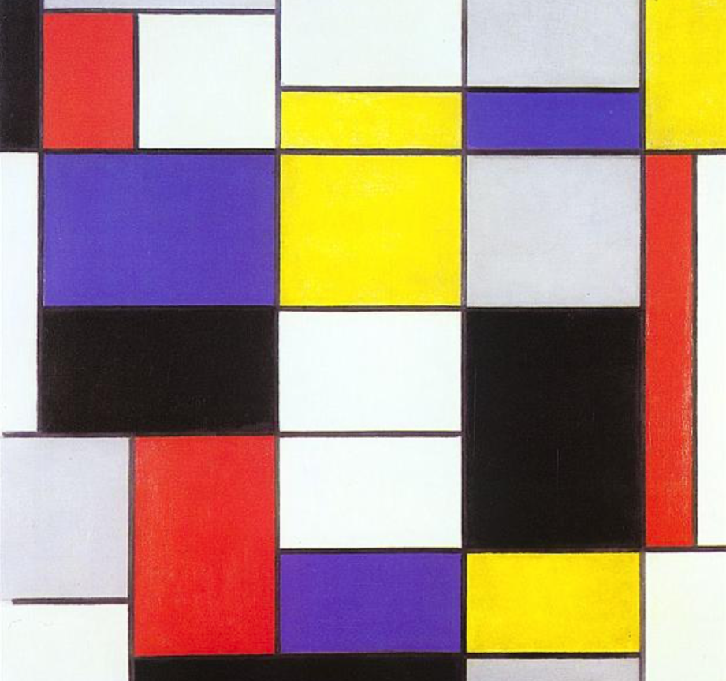
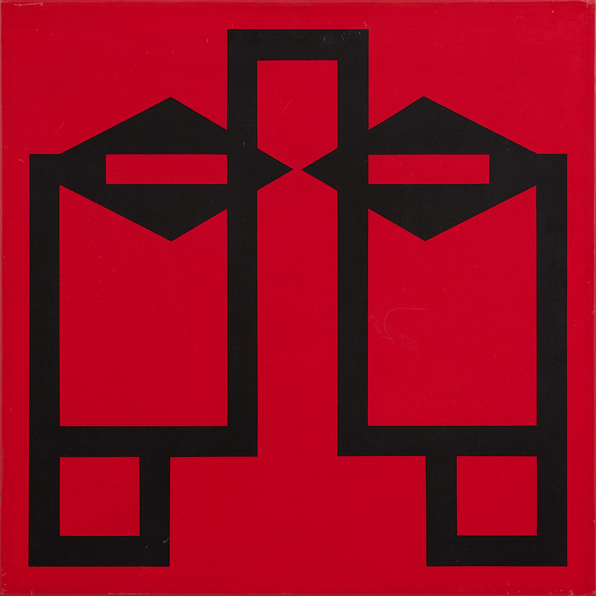
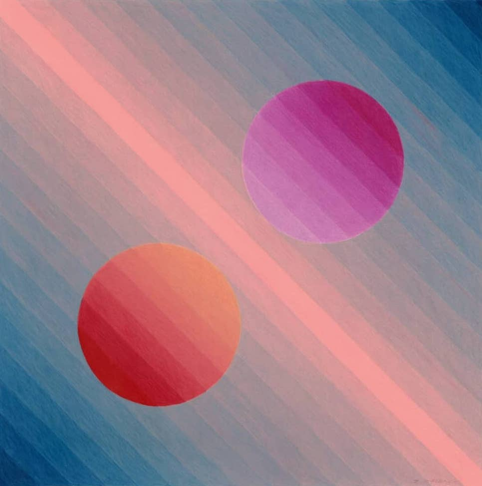
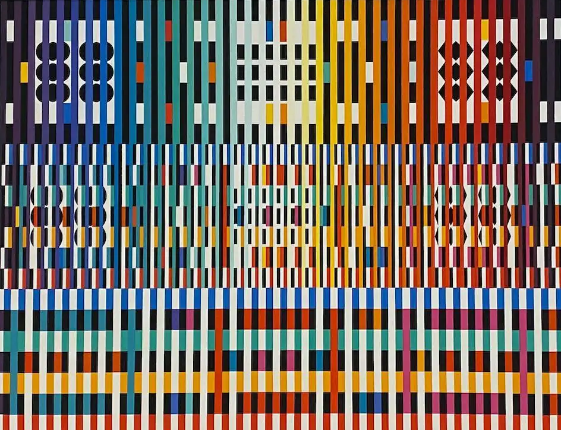
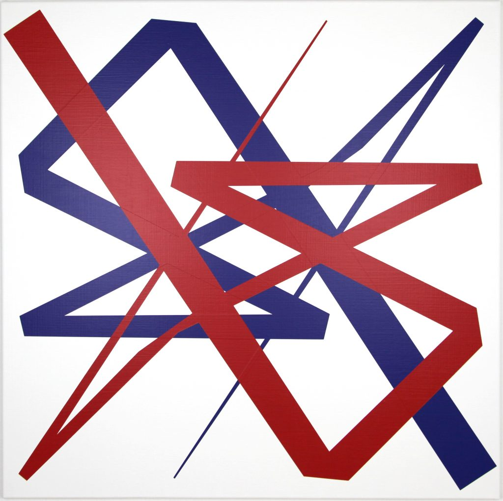

# Creative Coding For Beginners
  
Prof. Dr. Lena Gieseke \| l.gieseke@filmuniversitaet.de  
Elena Vasilkova \| elena.vasilkova@filmuniversitaet.de
  
  
# Exercise 01 - Introduction

This session is due on **Tuesday, April 15th** before class.  

* [Creative Coding For Beginners](#creative-coding-for-beginners)
* [Exercise 01 - Introduction](#exercise-01---introduction)
    * [Task 01.01 - Scripts](#task-0101---scripts)
    * [Task 01.02 - Setup](#task-0102---setup)
    * [Task 01.03 - Motivation](#task-0103---motivation)
    * [Task 01.04 - Drawing](#task-0104---drawing)
        * [Inspiration](#inspiration)

## Task 01.01 - Scripts

Recap the slides:

* [Introduction](../../03_slides/ccfb_ss25_01_intro_slides.html)
* [Setup](../../03_slides/ccfb_ss25_02_setup_slides.html)
* [Drawing](../../03_slides/ccfb_ss25_03_drawing_slides.html)

*Submission*: -

## Task 01.02 - Setup

1. Create a account for the [p5.js Editor](https://editor.p5js.org/).
2. Find your file in the [OwnCloud Folder](https://owncloud.gwdg.de/index.php/s/Vj3IQ39a5f4llPD) (PW: coding) and make sure that you can edit it.

*Submission*: -

## Task 01.03 - Motivation

Think about it why you want to learn creative coding. What would you like to achieve with it? What could be an interesting final project for you? 

Bullet points as answer are sufficient but please use whole sentences. 

*Submission*: Text directly in your OwnCloud file.

## Task 01.04 - Drawing

1. Draw the following house by *combining* shapes. 
2. Draw the same house with `beginShape` and `endShape`.  
  
3. Draw a smiley with simple shapes.   
For this task, you will need to have a look at [arcs](../../02_scripts/ccfb_ss25_03_drawing_script.md#arc).  

4. Draw a creative image with simple shapes. 

### Inspiration

You creative image can really be anything.  

In the context of creative coding and putting coding in an artistic context, you could try to think about carefully constructing a [visual design](https://editor.p5js.org/legie/sketches/cikqyBxbd). In my experience the visual quality is seldomly connected to the coding skills. Make use of what you have!

Some inspirations from classical artists:

  
[[Composition A, Piet Mondriaan, 1923]](https://www.wikiart.org/de/piet-mondrian/composition-a-1923) 

  
[[Several Circles, Wassily Kandinsky, 1926]](https://en.wikipedia.org/wiki/File:Vassily_Kandinsky,_1926_-_Several_Circles,_Gugg_0910_25.jpg)

  
[[Hadia geometria 36 – Alphabet 1, Mária Balážová, 1956]](https://www.1stdibs.com/art/prints-works-on-paper/abstract-prints-works-on-paper/yaacov-agam-thanksgiving/id-a_13123922/) 

  
[[ Drawing #220, Zanis Waldheims, 1969]](https://post.moma.org/zanis-waldheims/) 

  
[[Thanksgiving, Yaacov Agam, 1980]](https://www.1stdibs.com/art/prints-works-on-paper/abstract-prints-works-on-paper/yaacov-agam-thanksgiving/id-a_13123922/) 

  
[[Dürer, Pair Impair A, Vera Molnar, 2021]](https://www.apollonia-art-exchanges.com/en/vera-molnar/) 

*Submission*: Add links to your sketches in your OwnCloud file.

---

*Happy Starting!*
