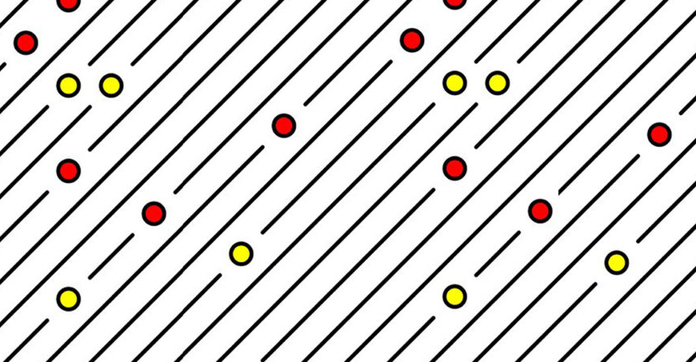

# Creative Coding For Beginners
  
Prof. Dr. Lena Gieseke \| l.gieseke@filmuniversitaet.de  
  
  
# Exercise 04 - Loops

This session is due on **Tuesday, May 6th** before class.  

---

* [Creative Coding For Beginners](#creative-coding-for-beginners)
* [Exercise 04 - Loops](#exercise-04---loops)
    * [Task 04.01 - Loops](#task-0401---loops)
    * [Task 04.02 - A Grid Pattern](#task-0402---a-grid-pattern)
            * [Task 04.03 - Interactive Parameters](#task-0403---interactive-parameters)

## Task 04.01 - Loops

Recap the scripts:

* [Loops](../../02_scripts/ccfb_ss25_07_loops_script.md)

*Submission*: -

## Task 04.02 - A Grid Pattern

Write a sketch that generates a pattern with a similar logic as the 10 PRINT example. You can use the code from the script as basis. Ideally, your pattern should follow an element-by-element and row-by-row iterative creation process - but don't feel limited be this. If you have other ideas for creating a pattern, go for it! The overall goal is to create a visual pleasing or interesting pattern up to your liking.  

Here an example:

*Submission*: Add a link to your sketch in your OwnCloud file.

#### Task 04.03 - Interactive Parameters

Make your pattern interactive by mapping at least one changeable visual characteristics to, e.g., the mouse and / or keys.

*Submission*: Add a link to your sketch in your OwnCloud file.

---

*Happy Looping!*
