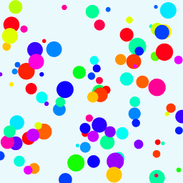

# Creative Coding For Beginners
  
Prof. Dr. Lena Gieseke \| l.gieseke@filmuniversitaet.de  
  
  
# Exercise 07 - Arrays

This session is due on **Tuesday, June 3rd** before class.  


---

* [Creative Coding For Beginners](#creative-coding-for-beginners)
* [Exercise 07 - Arrays](#exercise-07---arrays)
    * [Arrays](#arrays)
        * [Task 07.01 - Confetti](#task-0701---confetti)
            * [Variables](#variables)
            * [Variables](#variables-1)


## Arrays


### Task 07.01 - Confetti

Take the [animation of a circle code](https://editor.p5js.org/legie/sketches/JNJWuf7B7) and convert it to creating multiple circles (confetti!) at the same time. 

  
  

Make further adjustments to make the example your own.

  
Try to solve the exercise on your own first. If you don't know how to start, here two hints:

<details>
  <summary>Hint 1 </summary>
  
#### Variables

For example, use the following global variables:

```js
let numCircles = 100;

let positionX = [];
let positionY = [];

let stepX = [];
let stepY = [];

let hue = [];
let radius = [];
```

</details>

<details>
  <summary>Hint 2 </summary>
  
#### Variables

With the variables of Hint 1, to animate all circles and to access the arrays, use, e.g., a for-loop:

```js
...
for (let i = 0; i < numCircles; i++) {

    ...

    fill(hue[i], 100, 100);
    circle(positionX[i], positionY[i], radius[i]);

    ...
}
...
```
</details>
  
<br />

*Submission*: Add a link to your sketch in your OwnCloud file.


---

*Happy Confetting!*