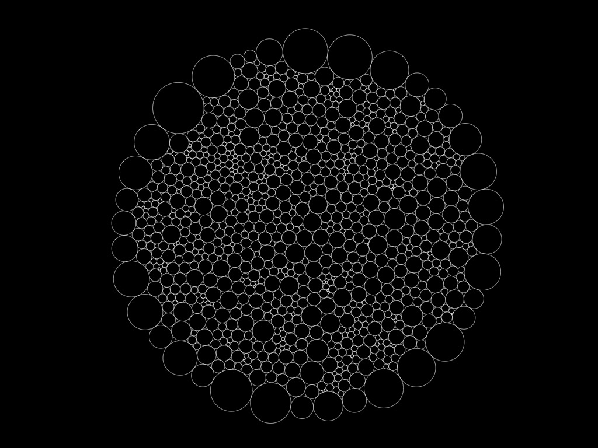
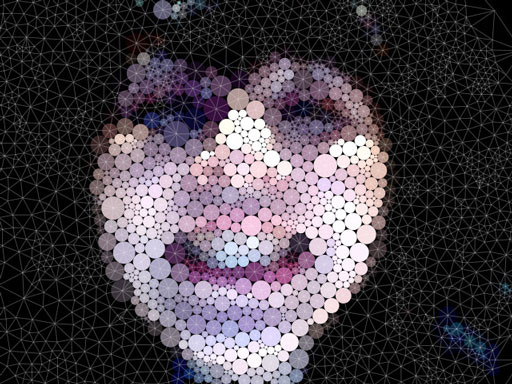
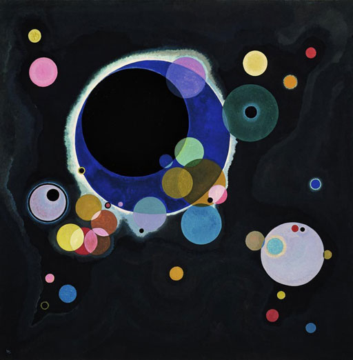
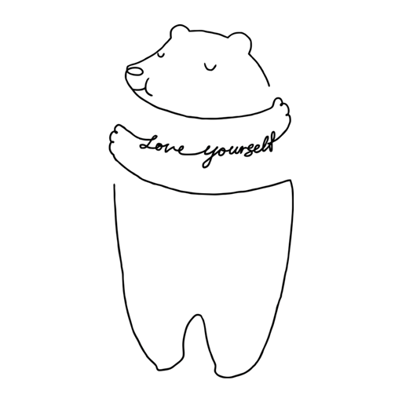
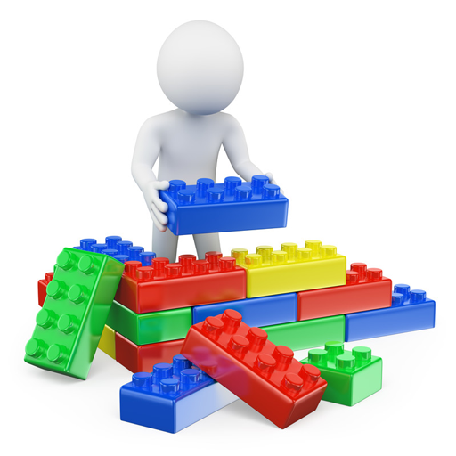
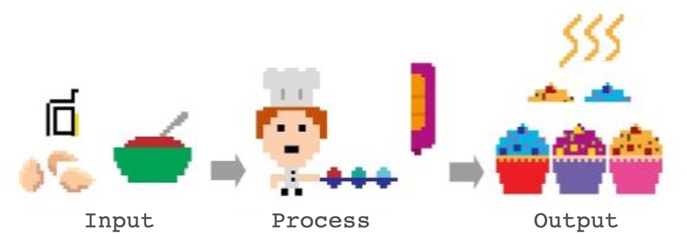

# Creative Coding For Beginners
  
Prof. Dr. Lena Gieseke \| l.gieseke@filmuniversitaet.de  
  


# Script 01 - Introduction

* [Creative Coding For Beginners](#creative-coding-for-beginners)
* [Script 01 - Introduction](#script-01---introduction)
    * [This Course](#this-course)
        * [Learning Objectives](#learning-objectives)
        * [Topics](#topics)
    * [Why Programming?](#why-programming)
        * [A Creative Process](#a-creative-process)
    * [Creative Coding](#creative-coding)
        * [Meaning What...?](#meaning-what)
        * [Become a Better You 😀](#become-a-better-you-)
        * [But I Hate Maths… 😳](#but-i-hate-maths-)
    * [What is Programming?](#what-is-programming)
        * [To Command!](#to-command)
        * [Like Writing a Recipe](#like-writing-a-recipe)
        * [You Can Not Assume Anything…](#you-can-not-assume-anything)
        * [It Is Not as Cryptic as You Might Think](#it-is-not-as-cryptic-as-you-might-think)
    * [What Are Programming Languages?](#what-are-programming-languages)
        * [Wikipedia says…](#wikipedia-says)
        * [Algorithms](#algorithms)
        * [Hello World 👋🏻](#hello-world-)
            * [C++](#c)
            * [C#](#c-1)
            * [Php](#php)
            * [Java](#java)
            * [JavaScript](#javascript)
            * [Python](#python)
            * [But Why?](#but-why)
        * [Hello World in p5.js?](#hello-world-in-p5js)
        * [Shouldn’t We Rather Learn ...?](#shouldnt-we-rather-learn-)
    * [References](#references)
    * [References](#references-1)

---

## This Course

You might think that for doing cool, e.g. visual stuff with coding you need mountains of coding knowledge. That is not true. Even a with a beginners skill level you can do nice things.

Look for example at these different possibilities to do visual designs and even art with just an arrangement of circles!

  
[[Circle Packing, Miu Ling Lam, 2010.]](https://miulinglam.files.wordpress.com/2010/02/cp09.jpg)

  
[[Circle Packing, Miu Ling Lam, 2010.]](https://miulinglam.files.wordpress.com/2010/02/cp10.jpg)

  
[[Verschiedene Kreise (1926), Wassily Kandinsky.]](https://miulinglam.files.wordpress.com/2010/02/cp09.jpg)

  
[[Komposition mit Kreisen und Linien (1926), Wassily Kandinsky.]](https://miulinglam.files.wordpress.com/2010/02/cp09.jpg)

*Do you like the above examples and if so, why?*

### Learning Objectives

With this course, you will gain

* an understanding of programming,
* **skills to develop simple programs from scratch**,
    * Knowledge about resources
    * Guidance towards and learning through self-studies,
* skills to apply programming as (an expressive) tool.

### Topics

Class topics can be divided into what you learn about programming itself and its *syntax* and what you do with your newly developed programming skill, meaning its application.

In regard to programming itself, we will cover:

* Commands, variables
* Events
* Conditions
* Loops
* Arrays
* Functions

We apply these programming skills to implement:

* Drawing, colors
* Interaction
* Movement / Animation
* Text and Typography
* Image, video
* Sound

<!-- 
## Introductions

* What is you background?
* Why do you want to learn programming? 
-->


## Why Programming?

What is programming or software actually useful for? Why didn't we stick with an abacus and writing everything by hand?  

Well, the answer is quite simple: there are countless tasks that computers can do better than humans. On the one hand computer solve problems and automatize tasks that have always been around such as knowing how to get from A to B and navigation. On the other hand with increased computational capabilities and the digitalization of or world, new tasks arise that didn't exist before, such as the internet.

### A Creative Process

*How would you define creativity?*

*What does creativity mean to you?*

Often times creative tasks are considered to be the ones that have a visual or auditive output, such as painting or playing an instrument. However that is not necessarily true. Rather creativity describes tasks where:

* You can create anything out of nothing
    * E.g. you start with an blank canvas
* Freedom of choice for a solution, many options
    * There is not one standrad solution

Hence even though tasks such as painting often enough are truly creative when it is for example in an artistic context. But types of activity do not stand for automatically for creativity.

With such an understanding of creativity, programming can actually considered a highly creative process!

*What makes programming a creative task?*

<!-- 

### Collaborative

TODO:

### Results are easily shared

TODO: 

-->

## Creative Coding

* Producing something expressive rather than with practical use
* Software beyond its standard usage scenarios

* *Aesthetics, insight, joy, communication, politics, augmentation, emotion, perspectives, friendship,...*


### Meaning What...?

* Algorithms and generative systems to create graphics and sounds
    * E.g. Procedural Generation and Simulation
* Smart data sources
    * Images, video, sound
    * Camera and microphone
    * Online resources such as Twitter and Instagram
    * Mobile devices as sensors
    * ...
* Interesting output formats
    * Web
    * From large-scale such as buildings to small-scale such as smart watches
    * Multi-screen setups for example with mobile devices
    * ...

* What do we have available and what can we do with it beyond the obvious?

### Become a Better You 😀

* Practice a systematic approach to problem solving
    * …reflect and come up with a plan
    * …divide and reduce
    * …reformulate
    * …start with what you know
    * …experiment
    * …working with the unknown
    * … build a healthy frustration tolerance and trust the process

* Please be gentle with yourself!
* You are learning a completely new skill
* You don’t know your approach yet

  
[[tattly]](https://tattly.com/products/love-yourself)

### But I Hate Maths… 😳

* Programming in itself has nothing to do with maths
    * Many programmers never use any maths at all
    * Certain applications might need maths, such as graphics and sound
* Programming is more like Sudoku
    * Solving one step at a time
    * Each step give hints for the next one
* Divide a problem into manageable sub-steps
* A bit like lego…




## What is Programming?

### To Command!

* Give commands to the computer
    * *Do this, then do that…*
    * *If this is true, do this; otherwise do that…*
    * *Do this 10 times…*
    * *Do this as long as…*


### Like Writing a Recipe

<!-- TODO: better image, this one is pixilated -->



* Write a recipe from scratch
* Start with another recipe as basis
* Use a can


### You Can Not Assume Anything…

* You deal with an apprentice with zero experience
    * You: *Add a packet of butter.*
    * Apprentice: *I don’t know what butter is.*
    * You: *Butter is an ingredient and is in the fridge. The fridge is in front of you. Butter is the packet on which there is written “butter”.*
    * Apprentice: *And now what?*
    * You: *Add the butter into the bowl.*
    * You: *Remove the packaging first!*


### It Is Not as Cryptic as You Might Think

```js
let points = 75;

if (points >= 50) {
    print("you won");
}
else {
    print("you lose");
}

print("done");
```


## What Are Programming Languages?

### Wikipedia says…

*A programming language is a **formal language**, which comprises a set of instructions that produce various kinds of output.*  
  

*Programming languages are used in computer programming to implement **algorithms.***
  

*A programming language's surface form is known as its **syntax.***

   
*[…] an algorithm is a set of instructions, **typically to solve a class of problems** or perform a computation.*

*Algorithms are **unambiguous** specifications for performing calculation, data processing, automated reasoning, and other tasks.*

  

*[…] the syntax of a computer language is the set of rules that defines the **combinations of symbols** that are considered to be a **correctly structured** document or fragment in that language.*

### Algorithms

*Give instructions for cleaning the dishes.*

 [[source]](https://www.montessoriprivateacademy.com/wp-content/uploads/2015/11/montessori-washing-dishes.png)


* Why inputs and data do we have?
* Why processes do we have?

Reflect on

* Do you do different things based on **conditions**? 
* How do you use the words **if** or **otherwise** in your instructions? 
* Do you use the word **repeat** in your instructions?


### Hello World 👋🏻

* Established as first “sanity check” for a programming language
* Text Input
    * Program Code
* Text Output
    * "Hello World"


#### C++

```c++
#include <iostream>

int main()
{
    std::cout << "Hello World!" << std::endl;
}
```

#### C#

```c#
class MainClass
{
    public static void Main()
    {
    System.Console.WriteLine("Hello World!");
    }
}
```

#### Php

```php
<?php
    print "Hello World!";
?>
```

#### Java

```java
class Hallo {
    public static void main( String[] args ) {
    System.out.print("Hello World!");
    }
}
```

#### JavaScript

```js
document.write("Hello World!");
```

#### Python

```python
print 'Hello World!'
```

#### But Why?

* Tradition
* First used by Brian Kernighan, 1974 in the Bell Laboratories
* http://helloworldcollection.de
    * 567 Hello World programs


### Hello World in p5.js?

* p5.js is optimized for designer and artists to develop graphics, sound and interaction
* Text Input
    * Program Code
* Graphics Output
    * Show something…

```js
//helloworld.js

function setup() {
    createCanvas(100, 100);
    background(255);
}

function draw() {
    point(50, 50);
}
```


<!-- Show OpenProcessing -->
[[1]](https://de.wikipedia.org/wiki/Liste_von_Hallo-Welt-Programmen/H%C3%B6here_Programmiersprachen)

### Shouldn’t We Rather Learn ...?

* The friend of my friend of my friend says…
* Which programming language someone prefers is somewhat of a religion and also depends on what you are used to.
* There is always the next “hot topics”.
* The one programming language to learn doesn’t exists.
    * They all have advantages and disadvantages.
    * It depends on specific application scenarios.
* p5.js is a good introduction
    * Especially for designer, artists, etc.
    * Everything you learn with p5.js, you can transfer to another programming language


## References

[[1] Wikipedia - Liste von Hallo-Welt-Programmen/Höhere Programmiersprachen](https://de.wikipedia.org/wiki/Liste_von_Hallo-Welt-Programmen/H%C3%B6here_Programmiersprachen)  

## References

[[1] Wikipedia - Liste von Hallo-Welt-Programmen/Höhere Programmiersprachen](https://de.wikipedia.org/wiki/Liste_von_Hallo-Welt-Programmen/H%C3%B6here_Programmiersprachen)  

---

*The End*  

💪🏾 💪🏻 💪