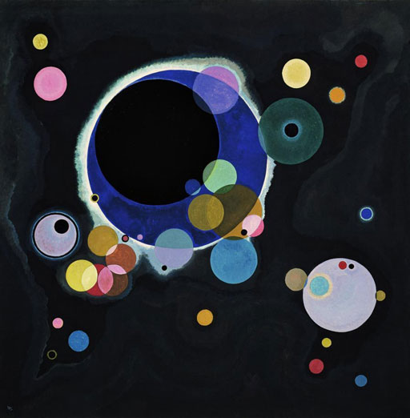

name: inverse
layout: true
class: center, middle, inverse
---

# Creative Coding For Beginners

### Prof. Dr. Lena Gieseke | l.gieseke@filmuniversitaet.de  

 
#### Film University Babelsberg KONRAD WOLF

---
layout:false

# Welcome 👋🏻 👋🏾 👋

???

  

* You might think that for doing cool, e.g. visual stuff with coding you need mountains of coding knowledge. That is not true. Even a with a beginners skill level you can do nice things.

Look for example at these different possibilities to do visual designs and even art with just an arrangement of circles!

---

.center[ .imgref[[[Circle Packing, Miu Ling Lam, 2010]](https://miulinglam.files.wordpress.com/2010/02/cp09.jpg)]]

???
  

* https://editor.p5js.org/
* Show circle

---

.center[ .imgref[[[Circle Packing, Miu Ling Lam, 2010]](https://miulinglam.files.wordpress.com/2010/02/cp10.jpg)]]

---

.center[  .imgref[[[miulinglam]](https://miulinglam.files.wordpress.com/2010/02/cp09.jpg)]   
Verschiedene Kreise (1926), Wassily Kandinsky] 

---

.center[  .imgref[[[miulinglam]](https://miulinglam.files.wordpress.com/2010/02/cp09.jpg)]   
Komposition mit Kreisen und Linien (1926), Wassily Kandinsky] 

???

  

https://openprocessing.org/sketch/522693
https://openprocessing.org/sketch/1493313
https://openprocessing.org/sketch/1633118

* Look for simple geometric art in the next week and see what makes it appealing.

---
layout:false

## Learning Objectives

With this course, you will gain

--

* An understanding of programming

--

* **Skills to develop simple programs from scratch**
    * Knowledge about resources
    * Guidance towards and learning through self-studies

--

* Skills to apply programming as (an expressive) tool

???
  

* But it is like a poetry class in Japanese

---

## Topics

???
* In regard to programming itself, we will cover

--

.left-even[
Programming:

* Commands, variables
* Events
* Conditions
* Loops
* Arrays
* Functions
* Maybe: Objects and Classes

*How to think?*
]

???

  

* Class topics can be divided into what you learn about programming itself and its *syntax* and what you do with your newly developed programming skill, meaning its application.
  
We apply these programming skills to implement:

--

.right-even[
Application:

* Drawings, colors
* Interaction
* Movement / Animation
* Image, video
* Sound
  
What is *creative* coding?
]

???

Mögliches Ergebnis:

https://editor.p5js.org/legie/sketches/Z-CUHtMhP

---
template:inverse

# Introductions

---

## Introductions

<!-- 
.center[] 
-->

The Team

* Lena Gieseke | l.gieseke@filmuniversitaet.de  (CTech Prof)
* Elena Vasilkova \| elena.vasilkova@filmuniversitaet.de (CTech Student)

--

And who are you?

* Your name?
* Your study program?
* Why do you want to learn programming? 

---
template: inverse

# Administration

---
.header[Administration]

## Schedule

**Lecture**: Tuesdays 14:00-16:00, Room 5104
* 2x 1h slots, with a break

--

**Exercise**: Tuesdays 14:00-16:00, Room 5104
* Individual code questions
* Practical coding tasks together
* Do the homework

--
  

Weekly **homework** assignments & a **final project**.

---
.header[Administration]

## ECTS

* 1 for attending the lectures 
* 1 for attending the exercises 
* 1-2 for completing the homework assignments 
* 1-3 for the final project

---
.header[Administration]

## Materials

--

All materials are published on the [course website](https://ctechfilmuniversity.github.io/lecture_ss25_creative_coding_for_beginners/)

* Usually before class, the material for that day is uploaded

--
  
 
  
All coding is done in with the [p5.js Editor](https://editor.p5js.org/)

* Please sign up for an account

---
.header[Administration]

## Homework

To hand in your homework assignment, you submit links to your sketches in an OwnCloud documents:

* [The OwnCloud Folder](https://owncloud.gwdg.de/index.php/s/Vj3IQ39a5f4llPD), PW: coding
* Open your file, add your text, links, etc.

---

## Administration

> Any further questions?

---
template: inverse

# Today

---
.header[Today]

## Learning Objectives

Today, you will

* know what to expect from the course (✓),
* be able to work with the p5 online editor,
* understand function calls, and
* be able to draw stuff.

???
  

* Next week we will look a bit deeper into what programming is, but today we want to get our hands dirty.

---
template:inverse

# The End  

💪🏾 💪🏻 💪