name: inverse
layout: true
class: center, middle, inverse
---

# Creative Coding For Beginners

### Prof. Dr. Lena Gieseke | l.gieseke@filmuniversitaet.de  


<br />
#### Film University Babelsberg KONRAD WOLF


---
layout:false

## Today

--
* Brief re-cap of everything so far


--
* Programming & Creative Coding

--
* Images

---

.center[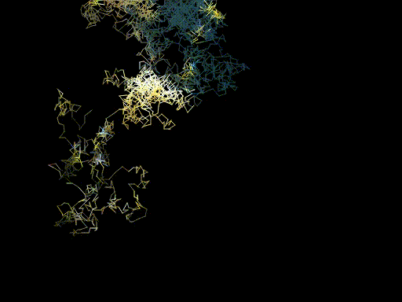]


???
* https://editor.p5js.org/legie/sketches/WWsJj-V0D


---

.center[]


???
* https://editor.p5js.org/legie/sketches/GN4wMPz4x
* 


---
template:inverse

##  What Happened So Far?

---
## What Happened So Far?

* p5.js Editor
    * The environment
    * Sketches
    * Errors (are our friends!)
    * Saving
    * Sharing

---
## What Happened So Far?

* The system loop

--

    * `setup()`, `draw()`
--
* Function calls and function definitions

--

    * `circle(200, 200, 100);`
    * `function circle(xPosition, yPosition, radius){}`

---
## What Happened So Far?

* Drawing commands

--

    * `arc()`, `ellipse()`, `circle()`, `line()`, `rect()`, `square()`, `triangle()`
    * `fill(r, g, b)`, `stroke(r, g, b)`, `strokeWeight(w)`
--
* Color systems: RGB, HSB


---
## What Happened So Far?

* Interaction

--

    * System variables: `mouseX`, `key`, `keyPressed`, ...
    * Functions: `function mousePressed(){}`, `function keyPressed(){}`, ...

---
## What Happened So Far?

* Conditionals

--
    * `if(condition is true){}`
    * `else{}`
--
* Operators
    * Comparison: `>`, `>=`, `<`, `<=`, `==`, `!=`
    * Logical Operators: `&&`, `||`, `!`

--
    * Arithmetic Operators: `+`, `-` , `*` , `/` , `++`, `--`, `+=`, `-=`, `*=`


???

& is bitwise AND

This operator is almost never used in JavaScript. Other programming languages (like C and Java) use it for performance reasons or to work with binary data. In JavaScript, it has questionable performance, and we rarely work with binary data.

This operator expects two numbers and returns a number. In case they are not numbers, they are cast to numbers.

&& is logical AND

Most usually, programmers use this operator to check if both conditions are true, for example:

true && true        // returns true
true && false       // returns false

However, in JavaScript, it is extended to allow any data type and any number of terms. It returns:

    First term that evaluates to false
    Last term otherwise (if all are true-y)

Here are some examples:

true && false && true         // returns false
true && 20 && 0 && false      // returns 0 (it is first false-y)
10 && "Rok" && true && 100    // returns 100 (as all are true-y)

https://stackoverflow.com/questions/7310109/whats-the-difference-between-and-in-javascript


---
## What Happened So Far?

* `&&`: logical AND
*  `&`: bitwise AND (not commonly used in JS)


???
The bitwise AND operator & compares each bit of two numbers and returns a new number where only the bits that are 1 in both numbers are set to 1. All other bits are set to 0.

Example:  
```
    6   = 0b0110
 &  3   = 0b0011
 --------
          0b0010  = 2
```
So, 6 & 3 equals 2.

It’s useful for things like:
* Checking if a specific bit is set.
* Applying bitmasks to extract certain bits.

Each position in a binary number represents a power of 2, just like each digit in a decimal number represents a power of 10.

Example:  
```
From right to left:
1 × 2⁰ = 1
1 × 2¹ = 2
0 × 2² = 0
1 × 2³ = 8
-------------
Total     = 11
```

So, 1011 in binary equals 11 in decimal.

Binary is a different number system, based on only two digits (0 and 1), which makes it ideal for representing electrical signals in computers (where 1 = ON, 0 = OFF).
Every decimal number (base 10) can be converted to binary (base 2), and every binary number can be converted back to decimal. They’re just different ways of representing the same quantity.

Binary is just a different representation, not a different value.

---
## What Happened So Far?
  
*On a Side Note:* `&&` short-circuiting

* When a false-y term is found, JS stops the evaluation
* `&&` used as a shorter replacement for an if statement

.footnote[[stackoverflow](https://stackoverflow.com/questions/7310109/whats-the-difference-between-and-in-javascript)]


--

```js
true && false && print("Never reached!")     // returns false
```

--
```js
if (user.isLoggedIn()) {
    print("Hello!")
}
```

--

```js
user.isLoggedIn() && print("Hello!")
```


---
## What Happened So Far?

* Variables
    * `let variableName = value;`
    * Variables have a data type
    * Variables live inside `{}` and have a scope
--
* Loops
    * `while(i < numberOfTimes){}`
    * `for(int i = 0; i < numberOfTimes; i++){}`

---
## What Happened So Far?

* 2D Loops

--

*For every row look at every element…*

```js
for (let y = 0; y < numberRows; y++) {

    for (let x = 0; x < numberColumns; x++) {
    
        print("Column: " + x + " Row: " + y);
    }
}
```

---
.header[What Happened So Far? | Nested For Loops]

<script type="text/p5" data-p5-version="1.6.0" data-autoplay data-height="500" data-preview-width="400" >
  
  
function setup() {
    createCanvas(300, 300);
}

function draw() {
    circle(75, 150, 50);
    circle(150, 150, 50);
    circle(225, 150, 50);
}
</script>


---
.header[What Happened So Far? | Nested For Loops]

<script type="text/p5" data-p5-version="1.6.0" data-autoplay data-height="500" data-preview-width="400" >
function setup() {
    createCanvas(300, 300);
}

function draw() {

    for (let cx = 75; cx <= 225; cx += 75) {

        circle(cx, 150, 50);
    }
}
</script>

.footnote[[[Happy Coding]](https://happycoding.io/tutorials/p5js/for-loops)]

---
.header[What Happened So Far? | Nested For Loops]

<script type="text/p5" data-p5-version="1.6.0" data-autoplay data-height="500" data-preview-width="400" >
function setup() {
  createCanvas(300, 300);
}

function draw() {

    for (let cx = 75; cx <= 225; cx += 75) {
        circle(cx, 75, 50);
    }

    for (let cx = 75; cx <= 225; cx += 75) {
        circle(cx, 150, 50);
    }

    for (let cx = 75; cx <= 225; cx += 75) {
        circle(cx, 225, 50);
    }
}
</script>

.footnote[[[Happy Coding]](https://happycoding.io/tutorials/p5js/for-loops)]


---
.header[What Happened So Far? | Nested For Loops]

<script type="text/p5" data-p5-version="1.6.0" data-autoplay data-height="500" data-preview-width="400" >
function setup() {
  createCanvas(300, 300);
}

function draw() {

    for (let cy = 75; cy <= 225; cy += 75) {
        for (let cx = 75; cx <= 225; cx += 75) {

            circle(cx, cy, 50);
        }
    }
}
</script>

.footnote[[[Happy Coding]](https://happycoding.io/tutorials/p5js/for-loops)]


---
## What Happened So Far?

Programming


---
## What Happened So Far?

Programming

.left-even[

* Break a problem into manageable pieces (*divide and conquer*)
]

---
## What Happened So Far?

Programming

.left-even[

* Break a problem into manageable pieces (*divide and conquer*)
* Work with what you have
]


---
## What Happened So Far?

Programming

.left-even[

* Break a problem into manageable pieces (*divide and conquer*)
* Work with what you have
* Test each step
    * Use `print` to check 
]


---
## What Happened So Far?

Programming

.left-even[

* Break a problem into manageable pieces (*divide and conquer*)
* Work with what you have
* Test each step
    * Use `print` to check 
* Do not copy the same code excessively
]


---
## What Happened So Far?

Programming

.left-even[

* Break a problem into manageable pieces (*divide and conquer*)
* Work with what you have
* Test each step
    * Use `print` to check 
* Do not copy the same code excessively
]

.right-even[
* Layout does matter
    * Represent the logic / structure
    * Prevent and find errors
]


---
## What Happened So Far?

Programming

.left-even[

* Break a problem into manageable pieces (*divide and conquer*)
* Work with what you have
* Test each step
    * Use `print` to check 
* Do not copy the same code excessively
]

.right-even[
* Layout does matter
    * Represent the logic / structure
    * Prevent and find errors
* Errors are part of the process
]

---
## What Happened So Far?

Programming

.left-even[

* Break a problem into manageable pieces (*divide and conquer*)
* Work with what you have
* Test each step
    * Use `print` to check 
* Do not copy the same code excessively
]

.right-even[
* Layout does matter
    * Represent the logic / structure
    * Prevent and find errors
* Errors are part of the process
* Use the reference, look at example code
]

---
## What Happened So Far?

### Further Questions? 🤔

---
template: inverse

# Programming?

--

# Creative Coding?

---
template: inverse

## *Why Programming?*


---
.header[Why Programming?]

## Computers Can Do It Better 🤖

--

.left-even[

* Task automatization / improvements
]


---
.header[Why Programming?]

## Computers Can Do It Better 🤖

.left-even[

* Task automatization / improvements
    * E.g., navigation
]


---
.header[Why Programming?]

## Computers Can Do It Better 🤖

.left-even[

* Task automatization / improvements
    * E.g., navigation
* Novel tasks
]

---

.header[Why Programming?]

## Computers Can Do It Better 🤖

.left-even[

* Task automatization / improvements
    * E.g., navigation
* Novel tasks
    * E.g., the internet

]

--

.right-even[

* For many tasks, software…
    * …thinks faster
    * …has a better memory
    * …is better in multitasking
    * …is not getting tired
]


???

.task[ASK:]  

* How would you define creativity?

---
template:inverse

## *How do you define creativity?*


---
template:inverse

## *How are you creative?*

---
.header[Why Programming?]

## A Creative Process

--

.left-even[
* You can create anything out of nothing
]


---
.header[Why Programming?]

## A Creative Process


.left-even[
* You can create anything out of nothing
* Freedom of choice for a solution, many options
]


---
.header[Why Programming?]

## A Creative Process


.left-even[
* You can create anything out of nothing
* Freedom of choice for a solution, many options
    * A bit like lego…
]

.right-even[]


---
.header[Why Programming?]

## A Creative Process


.left-even[
* You can create anything out of nothing
* Freedom of choice for a solution, many options
    * A bit like lego…
* Results are easily shared
* (Collaborative)
]

.right-even[]


---
template: inverse

## *Creative Coding?*


---
layout: false

.center[[](https://owncloud.gwdg.de/index.php/s/ZtWMVcHEpmrknE3)]
    
.footnote[[Chris Milk. 2012. [*The Johnny Cash Project*](https://www.radicalmedia.com/work/the-johnny-cash-project/). Radical Media]]


???

* Animation spiegelt das Thema des Liedes über Sterblichkeit, Wiedergeburt und das ewige Leben.
* Was Ihr hier gesehen habt ist aber nicht nur eine Animation. 
* Es ist ein kollaboratives Projekt an dem bis heute über 250000 Menschen aus 172 Ländern teilgenommen haben.
*  Es ist ein online Projekt mit dem jeder einen einzelnen Frame des originalen Video interpretieren kann.
*  Darüber hinaus kann man auf der Webseite sich alle Frames einzeln anschauen, verschieden Konfigurationen des Video ansehen, Frames werden zum Bespiel nach Stil getackt. 
*  Des weiteren nimmt die Webseite den Prozess des Malens auf, so dass man sich hinterher anschauen kann, wie die einzelnen zu Ihrem Endergebnis gekommen sind.
*  Dazu hier ein Video in dem der Erschaffer der Seite, Medienkünstler Aaron Koblin, der die Benutzung der Webseite kurz erklärt…
  


---

.center[[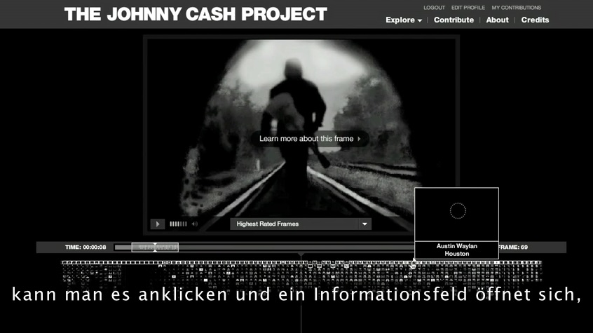](https://owncloud.gwdg.de/index.php/s/IVvTrSu2GL4gTvX)]
    
.footnote[[Chris Milk. 2012. [*The Johnny Cash Project*](https://www.radicalmedia.com/work/the-johnny-cash-project/). Radical Media]]


???

* Und durch diese mögliche Interaktion mit der Webseite, wird die Animation zu einer dynamischen sich kontinuierlich entwickelnden Datenbank an möglichen Outputs und die Website zu einem erzählenden und Menschen verbindenden Medium.
* Dazu hier noch mal ein kurzes Video, in dem Teilnehmer ihre Erfahrung kommentieren.

---
.center[[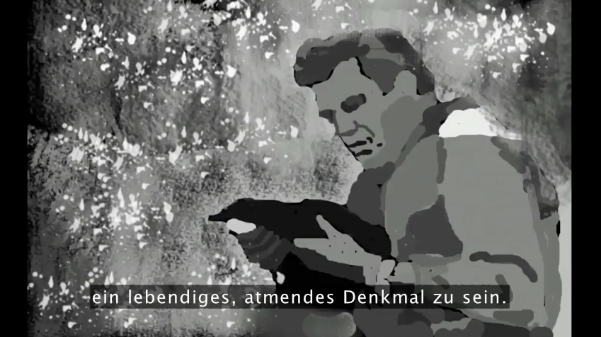](https://owncloud.gwdg.de/index.php/s/LYx9pV3hPcUzChu)]
    
.footnote[[Chris Milk. 2012. [*The Johnny Cash Project*](https://www.radicalmedia.com/work/the-johnny-cash-project/). Radical Media]]


???

* Schlüsselaussage: die Webseite, also die Application erzeugt “A living, breathing memorial” an dem wir alle teilhaben können.
* Dieses Projekt zeigt wie durch den durchdachten und kreativen Einsatz von Technik, die Technik selbst eine ganz besondere Bedeutung bekommt und wie in diesem Fall nicht nur eine interessante Animation produziert sondern eine tiefergehende und gemeinschaftliche Erfahrung für den User oder das Publikum geschaffen wird.


---
## Creative Coding

???

* There are actually no fixed definitions of what *creative coding* means. 
* Within CTech we understand creative coding as:

--

* Producing something expressive rather practical

--

* Software beyond its standard usage scenarios

--
* Tools that help others to be creative

???


The last aspect of developing tools is somewhat detached and not necessarily part of a common understanding of creative coding. However, to us it is and equally important topic. We would like to integrate tool development into our portfolio with the goal of developing tools beyond the obvious and beyond practicability. When thinking about tool development in the context of web technologies, collaborative work and sharing ideas, content, etc. in the virtual space are exciting directions to go.

---

## Creative Coding


> Aesthetics, insight, joy, dialog, politics, collaboration, augmentation, emotion, perspectives, friendship,...

--

<br />
*How could you explore one of the above mentioned terms with a software project?*


---
## Creative Coding


???
For your creative work, I would like to encourage you to use the following as guidance:

--

> What do I have available and what can I do with that beyond the obvious?
  

--

# ☝🏻


???
* Available also in reference to one own skill set


---

## Creative Coding

--
* Algorithms and generative systems to create graphics and sounds

--
* Smart data sources
    * Images, video, sound
    * Camera and microphone
    * Online resources such as Twitter and Instagram
    * Mobile devices as sensors
    * ...

---
## Creative Coding


* Interesting output formats
    * Web
    * From large-scale such as buildings to small-scale such as smart watches
    * Multi-screen setups for example with mobile devices
    * ...


???
* We read, experience, share and create with the potential community of all web users. 

> Who are all web users?

* We will focus on web-based programming environments


---
.header[Creative Coding | Examples]

## Paper Planes

[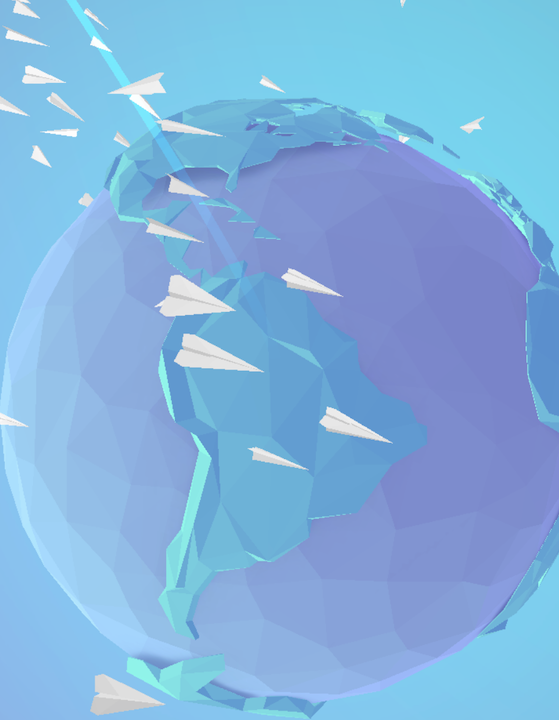  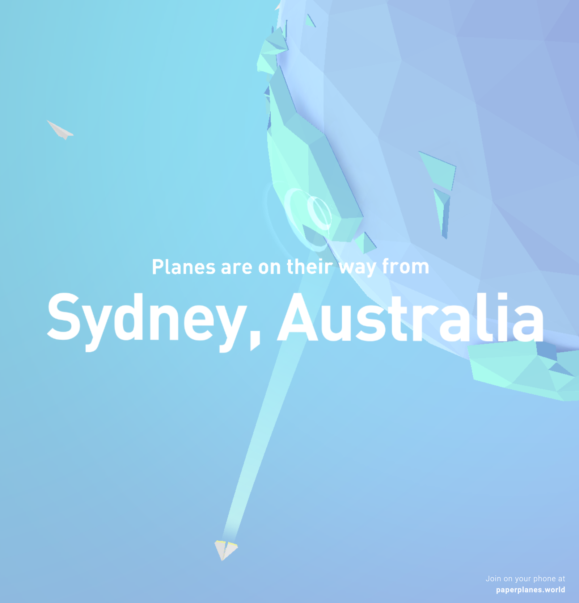](https://paperplanes.world/) [[Paper Planes ⬀]](https://paperplanes.world/)

<!-- [](https://paperplanes.world/)   -->
<!-- [[Paper Planes]](https://paperplanes.world/) -->


<!-- 
[](https://armsglobe.chromeexperiments.com/)  
[[Arms Globe]](https://armsglobe.chromeexperiments.com/)


[](https://deck.gl/showcases/wind/)  
[[deck.gl]](https://deck.gl/showcases/wind/)


[](https://lines.chromeexperiments.com/) [[Land Lines]](https://lines.chromeexperiments.com/)

* The website of Zach Lieberman lets you explore Google maps satellite images through gestures. With the draw option, you can find similar satellite images that match the line that you draw on the screen. With the drag option, you can draw an infinite landscape based on your mouse movement.

-->

---
.header[Creative Coding | Examples]

## Unnumbered Sparks

[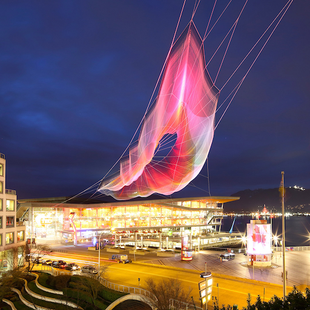](https://www.youtube.com/watch?v=npjTmG-TBHQ&feature=emb_logo) [[Unnumbered Sparks ⬀]](http://www.aaronkoblin.com/project/unnumbered-sparks/)


---
.header[Creative Coding | Examples]

## Cinemetrics

[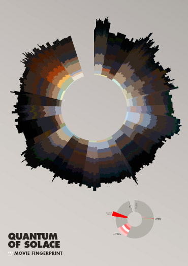](https://cinemetrics.site/) [[Cinemetrics ⬀]](https://cinemetrics.site/)


???

.task[TASK:]  

* stop 1:25

---
template: inverse

## *What type of tools are possible through the web?*


???
* What type of tools are possible through the web?

---
.header[Creative Coding | Examples]

## Zoom

[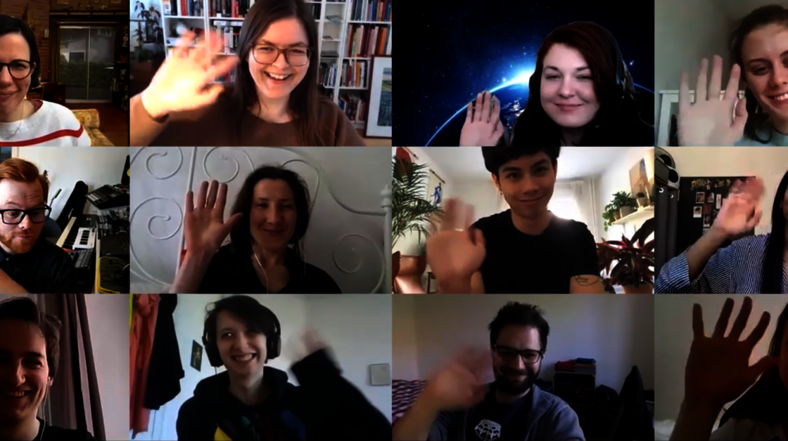](https://miro.com/)


---
.header[Creative Coding | Examples]

## Miro Board

[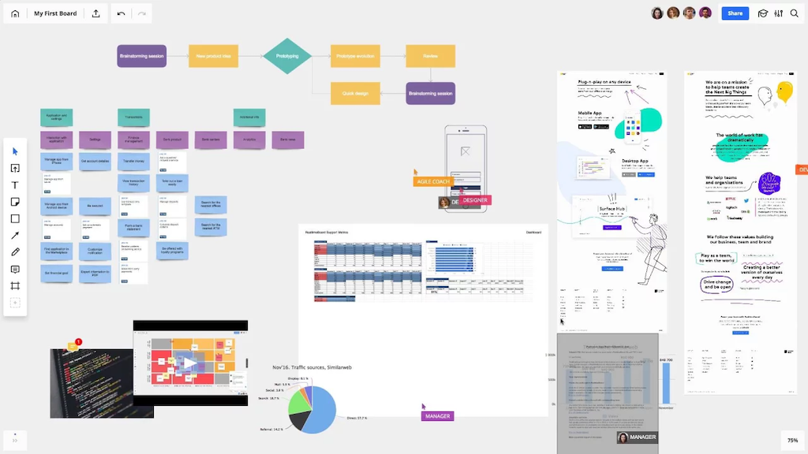](https://miro.com/)

--

> How to make this system more fun or more interesting? Any ideas?
  

---
.header[Creative Coding | Examples]

## Live Coding

.left-even[
[Hydra](https://hydra.ojack.xyz/docs/#/)

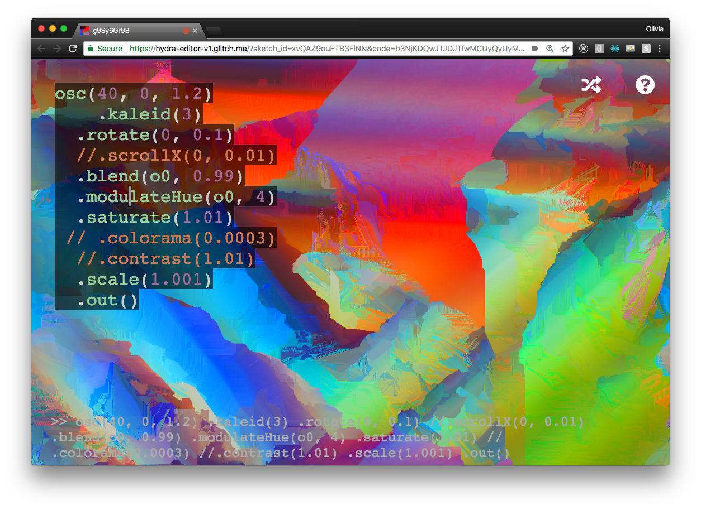
]
.right-even[
* For audivisual performances
* Open-source
* All-levels
]

???

For example with [Hydra](https://hydra.ojack.xyz/docs/#/) you can live code in the browser for audiovisual performances. It is free and open-source and made for beginners and experts alike.


* https://hydra.ojack.xyz/?sketch_id=ritchse_3
* https://hydra.ojack.xyz/docs/#/
* https://cdm.link/2019/02/hydra-olivia-jack/


---
.header[Creative Coding | Examples]

## Cloud-Based Systems

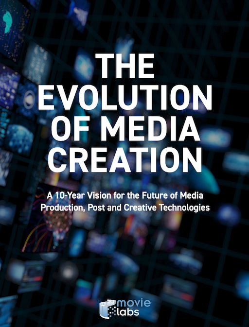 [[Movielabs]](https://movielabs.com/wp-content/uploads/2019/12/movielabs_evolution_media_creation_2.0.pdf)

???


*The evolution of media creation - A 10-Year Vision for the Future of Media Production, Post and Creative Technologies* entnommen.  

Neben den gerade beschriebenen neuartigen Kollaborationsmöglichkeiten bringt uns diese Veröffentlichung auch schon zur zweiten Motivation für eine Arbeit mit Cloud-basierten Technologien.  

Der zweit Grund ist, dass wir tatsächlich schon mitten drin sind:  

Cloud-basierte Technologien und Prozess sind auf dem Vormarsch, nicht zu letzt weiter befeuert durch die Pandemie. Besagte Veröffentlichung beschreibt als erste von 10 Visionen für das Jahr 2030 folgendes: 
 
---
.header[Creative Coding | Examples]

## Cloud-Based Systems

> We can expect that media creation workflows will be cloud based with every file (from first script, to camera capture, VFX assest and audio tracks) stored in the cloud.


.footnote[[[The Evolution of Media Creation - A 10-Year Vision for the Future of Media Production, Post and Creative Technologies]](https://movielabs.com/)]

???


Des weiteren wird gesagt dass sich alle Produktionsprozesse fundamental dahingehend verändern, dass Software zu den Daten kommt... und nicht genau umgekehrt wie es gerade ist.

Also, wir wissen nun das Cloud-basierte Prozesse eng mit Fragen nach Kollaborationsmöglichkeiten zusammenhängen und dass es sich hier grundsätzlich um ein *hot topic* handelt mit dem es gilt sich auseinanderzusetzen.  

---
.header[Creative Coding | Examples]

## Cloud-Based Systems

All assets are created or ingested straight into the cloud and do not need to be moved.

--

<br/>
### -> Applications come to the data!


???

Do you know of any creative coding examples? Please share!


---

## Creative Coding

<br/>

> What do we have available and what can we do with it beyond the obvious?

???


.header[Why Programming?]

## Become a Better You 😀


* Practice a systematic approach to problem solving


    * …reflect and come up with a plan
    * …divide and conquer
    * …start with what you know
    * …reformulate
    * …work with the unknown
    * …build a healthy frustration tolerance and trust the process


* Use your intuition and emotions, experiment


.header[Why Programming?]

## Become a Better You 😀

.left-even[
* You are learning a completely new skill
* You don’t know your approach yet
]

.right-even[ .imgref[[tattly](https://tattly.com/products/love-yourself)]]


.header[Why Programming?]

## But I Hate Maths… 😳

* Programming in itself has nothing to do with maths  
    * Many programmers never use any maths at all
    * Certain applications might need maths, such as graphics and sound
* Programming is more like Sudoku
    * Solving one step at a time
    * Each step give hints for the next one
* Divide a problem into manageable sub-steps


---
template: inverse

## *What is Programming?*


???

## What is Programming?
### To Command!

* Give commands to the computer
    * *Do this, then do that…*
    * *If this is true, do this; otherwise do that…*
    * *Do this 10 times…*
    * *Do this as long as…*

---
.header[What is Programming?]

## Like Writing a Recipe

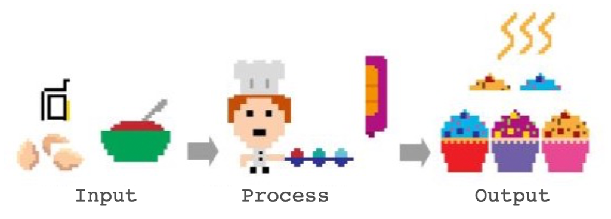

--

1. Write a recipe from scratch

--
2. Start with another recipe as basis

--
3. Use a can


???


## You Can Not Assume Anything…

You deal with an apprentice with zero experience!

* You: *Add a packet of butter.*
* Apprentice: *I don’t know what butter is.*
* You: *Butter is an ingredient and it is in the fridge. The fridge is in front of you. Butter is the packet on which there is written “butter”.*
* Apprentice: *And now what?*
* You: *Add the butter into the bowl.*
* You: *Remove the packaging first!*

> What you can assume the computer knows depends on the programming environment.


## It Is Not as Cryptic as You Might Think

```js
let points = 75;

if (points >= 50) {
    print("you won");
}
else {
    print("you lose");
}

print("done");
```

* Show maybe in editor
* https://editor.p5js.org/


---
template:inverse

## *What Are Programming Languages?*

---
.header[What Are Programming Languages?]

## Wikipedia says…

*A programming language is a **formal language**, which comprises a set of instructions that produce various kinds of output.*  
  
--
  
<br/>

*Programming languages are used in computer programming to implement **algorithms.***
  
--
  
<br/>
  
*A programming language's surface form is known as its **syntax.***


???

* There are hundreds of programming languages
  
We are using [JavaScript](https://developer.mozilla.org/en-US/docs/Web/javascript) in the class, which is the language for dynamic websites.
  
You can imagine p5 as an extension for JavaScript.

---
.header[What Are Programming Languages?]

## Syntax

--

*[…] the syntax of a computer language is the set of rules that defines the **combinations of symbols** that are considered to be a **correctly structured** document or fragment in that language.*

--

```js
for (let i = 0; i <= 100; i++) {

    circle(i, i, 10);
}

```


---
.header[What Are Programming Languages?]

## Algorithm

--


*[…] an algorithm is a set of instructions, **typically to solve a class of problems** or perform a computation.*

<br />

*Algorithms are **unambiguous** specifications for performing calculation, data processing, automated reasoning, and other tasks.*


---
.header[What Are Programming Languages?]

## Algorithm

--

*Give instructions for cleaning the dishes.*

--
.left-even[
* With what are we working?
    * Inputs, data
* What is the process?
]

--
.right-even[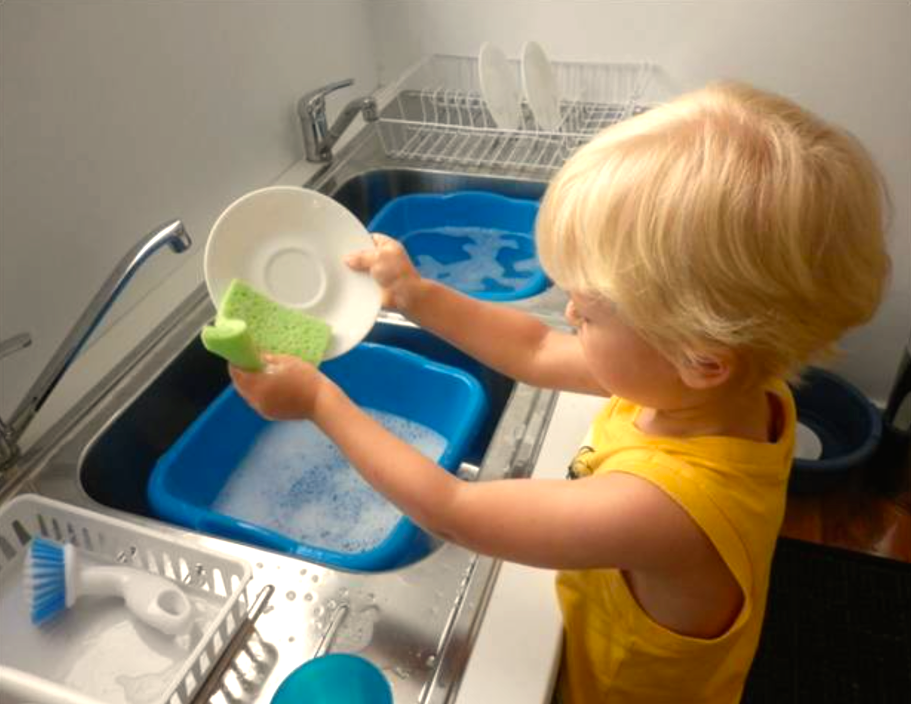  .imgref[[[source]](https://www.montessoriprivateacademy.com/wp-content/uploads/2015/11/montessori-washing-dishes.png)]]


???

* (plate, sponge, water, tap, soap, dirt)


---
template:inverse

## Examples


???
   

* https://editor.p5js.org/legie/sketches/ZMRephHbg

* For a better understanding of the grid structure and also of operators, here a couple of examples.

---

## Examples

*How can you control the fill command to create the following examples?*

.center[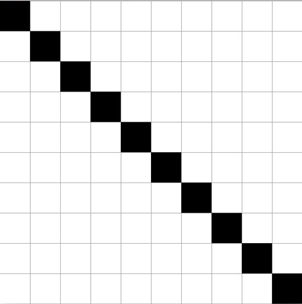]

---
.header[2D Loops]

```js
// https://editor.p5js.org/legie/sketches/lWJGIhhtI
function draw() {

    // Nested loop to run over all pixels of the canvas
    for (let y = 0; y < canvasSize; y+=stepSize) {
        for (let x = 0; x < canvasSize; x+=stepSize) {


            fill(255);
            // Changing the fill color
            // only for the cells on the
            // diagonal
            if ( y == x) {
                fill(0);
            }

            rect(x, y, stepSize, stepSize);
        }
    }
}
```

---


### Examples

.center[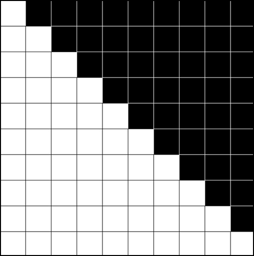]

---


```js
// https://editor.p5js.org/legie/sketches/5x1bAs66K

function draw() {

    for (let y = 0; y < canvasSize; y+=stepSize) {
        for (let x = 0; x < canvasSize; x+=stepSize) {

            stroke(0);
            fill(255);

            if (x > y) {
                stroke(255);
                fill(0);
            }

            rect(x, y, stepSize, stepSize);
        }
    }
}
```

---


### Examples


.center[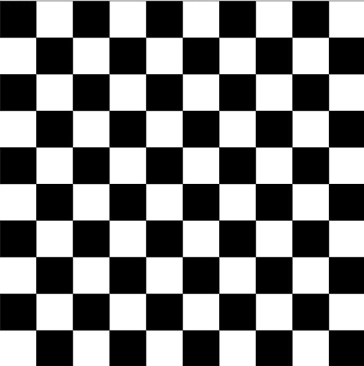]


???
   

* The overall logic to create a checkerboard is to fill every other cell black and to shift that every other row. 

* You could also say that in the even rows (meaning the 0., 2., 4. row...), the even columns (meaning the 0., 2., 4. column...) should be black, and in the uneven rows, the uneven cells should be black.

* You can identify even numbers with the modulo operator.

---
template:inverse

### Syntax

## The Modulo Operator

---


## The Modulo Operator

--

The [modulo](https://www.computerhope.com/jargon/m/modulo.htm) operator returns for a division with a whole number the rest of that division:

```js
// Pseudo Code
 5 / 2 is 2 with rest 1
 8 / 2 is 4 with rest 0
 6 / 3 is 2 with rest 0
30 / 9 is 3 with rest 3
```
--
```
 5 % 2 = 1  
 8 % 2 = 0  
 6 % 3 = 0  
30 % 9 = 3  

```


???

```
5 / 2 is 2 (the quotient) with rest 1  

x / y is quotient q with rest r
x = q * y + r
```

---


## The Modulo Operator

This comes in handy when testing for even numbers:

--

```js
let number = 7;

if (number % 2 == 0) {

    print("even");
}
```


---
```js
// https://editor.p5js.org/legie/sketches/_NHk4arDR
function draw() {

    for (let y = 0; y < canvasSize; y += stepSize) {
        for (let x = 0; x < canvasSize; x += stepSize) {
            fill(255);

            // We need to divide by stepSize
            // to get the indices
            let row = y / stepSize;
            let column = x / stepSize;

            if ( ((row % 2 == 0) && (column % 2 == 0)) ||
                 ((row % 2 != 0) && (column % 2 != 0)) ) {

                    fill(0);
            } 
            rect(x, y, stepSize, stepSize);
        }
    }
}
```


???
* In our example, we can not work directly with the pixel coordinates, as by adding an even `stepSize` for the grid, we only have even pixel coordinates, such as 0, 100, 200,... 
* We need to divide the coordinates by `stepSize` to get the indices of the cells, with which we then want to do the modulo operation. 

???


.header[What Are Programming Languages? | Algorithms]

## Hello World 👋🏻


* Established as first “sanity check” for a programming language
* Text in- and output
    * Input: Program Code
    * Output: "Hello World"


???

* Show terminal


.header[What Are Programming Languages? | Algorithms]

## Hello World 👋🏻

.center[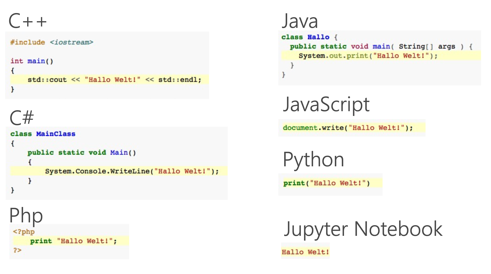  .imgref[[[wiki]](https://de.wikipedia.org/wiki/Liste_von_Hallo-Welt-Programmen/Höhere_Programmiersprachen#Java)]]


.header[What Are Programming Languages? | Algorithms]

## Hello World 👋🏻

### But Why?

* Tradition
* First used by Brian Kernighan, 1974 in the Bell Laboratories
* http://helloworldcollection.de
    * 567 Hello World programs

???


[[wikipedia]](https://de.wikipedia.org/wiki/Liste_von_Hallo-Welt-Programmen/H%C3%B6here_Programmiersprachen)

???

.task[TASK:]  


## Hello World in p5.js?

p5.js is optimized for designer and artists to develop graphics, sound and interaction.


* Input: Program Code
* Output: Graphics


```js

function setup() {
    createCanvas(100, 100);
    background(255);
}

function draw() {
    point(50, 50);
}
```


* Show [Sketch](https://openprocessing.org/sketch/1011532)


[[1]](https://de.wikipedia.org/wiki/Liste_von_Hallo-Welt-Programmen/H%C3%B6here_Programmiersprachen)


## Shouldn’t We Rather Learn ___?


* The friend of my friend of my friend says…

* Which programming language someone prefers is somewhat of a religion and also depends on what you are used to.

* There is always the next “hot topics”.

* The one programming language to learn doesn’t exists.
    * They all have advantages and disadvantages.
    * It depends on specific application scenarios.

* p5.js is a good introduction
    * Especially for designer, artists, etc.
    * Everything you learn with p5.js, you can transfer to another programming language


## References

[[1] Wikipedia - Liste von Hallo-Welt-Programmen/Höhere Programmiersprachen](https://de.wikipedia.org/wiki/Liste_von_Hallo-Welt-Programmen/H%C3%B6here_Programmiersprachen)  


---
template:inverse

### The End  

# 🕺🏻 💙 🤖