name: inverse
layout: true
class: center, middle, inverse
---

# Creative Coding For Beginners

### Prof. Dr. Lena Gieseke | l.gieseke@filmuniversitaet.de  


<br />
#### Film University Babelsberg KONRAD WOLF


---
layout:false

## Today

--
* Re-cap
    * Arrays
    * Homework
    * Algorithmic Thinking

--
* Code Organisation with Functions

--
* Sound

--
* Libraries

--
* Anatomy of a Webpage


???
  

* https://editor.p5js.org/legie/sketches/2nuJGEvFr


---
template:inverse

# Arrays


???
  

* Is what?

---


## Arrays

With arrays we can save multiple values in one variable.

```js
let myArray = [2, 4, 6, 8];
```

--

Arrays are accessed with `[]` and an index, starting at `0`.


```js
print(myArray[2]); // 6
```


---


## Arrays

You can use loops to access all elements of an array.

```js
for (let i = 0; i < myArray.length; i++) {
    print('Element', i, ': ', myArray[i]);
}
```

--

```js
for (let element of myArray) {

    print('Element', element);

}
```

---


## Arrays

* `push` adds a new element to the end of an array 
* `pop` remove the last element of an array


---
## Homework

--

### Confetti

Take the animation of a circle code and convert it to creating multiple circles (confetti!) at the same time.


???
  
* Start: https://editor.p5js.org/legie/sketches/JNJWuf7B7
* Finished: https://editor.p5js.org/legie/sketches/LyTHREIeS


---


## Algorithmic Thinking


--
The goal is an **algorithm**, 

--
which we understand as defining a list of steps to finish a task.

.footnote[[[code.org]](https://code.org/curriculum/course3/1/Teacher)]

  
--
  
Algorithmic thinking applies:

--
  
* **Decomposition**: Breaking a large problem into smaller, manageable parts to make it easier to solve.

--
* **Pattern Matching**:  Identifying similarities in problems to reuse solutions or processes.

--
* **Abstraction**: Simplifying a problem by focusing on important details and ignoring specifics.


---
.header[Algorithmic Thinking]

## Example

--
> How to play this game?
  
--

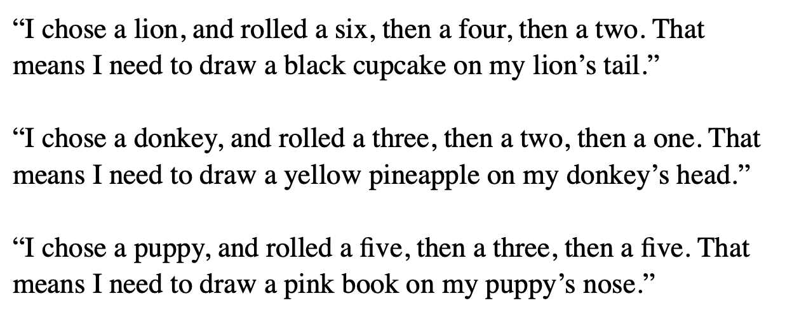


???
  

* Using pattern matching and abstraction!


---
.header[Algorithmic Thinking]

## Example

> Which parts are matching and which differ from player to player? 
  


---
.header[Algorithmic Thinking]

## Example

> Using pattern matching and abstraction!


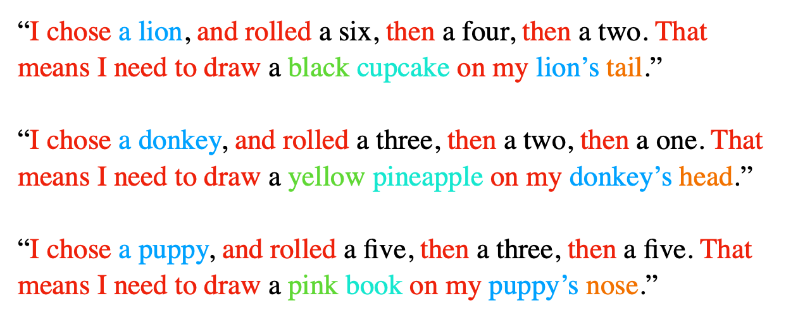


---
.header[Algorithmic Thinking]

## Example


  
Color:
1) Red
2) Blue
3) Yellow
4) Green
5) Pink
6) Black
  
Items:
1) Cell Phone
2) Pineapple
3) Book
4) Cupcake
5) Tentacle
6) Bow
  
Bodypart:
1) Head
2) Tail
3) Foot
4) Belly
5) Nose
6) Back


???
  

Figure out how to play this game by looking at the players’ phrases below. Circle the matching parts and underline words that are different from player to player. The first matching section has been circled for you.

* What kind of cloth do you put on in the morning?


---
.header[Algorithmic Thinking]

## Example

Develop a to-do list application.

* Decomposition
* Pattern Matching
* Abstraction


???

Concept	Example from To-Do List App Development
Decomposition	Breaking down app features into smaller tasks
Pattern Matching	Recognizing that add, edit, and delete follow a similar pattern
Abstraction	Creating a generic function to handle different actions


---
.header[Algorithmic Thinking | Example]

## To-do List App

**Decomposition**

--

* Design the user interface
* Create a backend to store tasks
* Implement functionality to add, delete, and edit tasks
* Handle user authentication
* Ensure the app works on mobile and desktop

---
.header[Algorithmic Thinking | Example]

## To-do List App

**Pattern Matching**  

--

For example, the processes for adding, editing, and deleting tasks are very similar.


???
* They all involve interacting with a task object and updating the task list.

--

Pattern:
* Add Task: Create a new task object and append it to the list
* Edit Task: Find the task in the list and modify its properties
* Delete Task: Find the task in the list and remove it


???
* Identifying reusable logic across different tasks

You recognize this pattern and reuse the same logic for each action instead of writing unique code for each operation.

---
.header[Algorithmic Thinking | Example]

## To-do List App

**Abstraction**

--

Instead of separate functions for adding, editing, and deleting tasks, create a generic function that updates the task list based on an action type:

---
.header[Algorithmic Thinking | Example]

```python
function update_task_list(task_list, task, action){

    if(action == 'add') {
        task_list.append(task)
    }
    else if(action == 'edit') {
        for t in task_list {
            if(t['id'] == task['id']){t.update(task)}
        }
    }
    else if(action == 'delete'){
        task_list = []
        for t in task_list {
            if(t['id'] != task['id']){task_list.append(t)}
        }
    }
    return task_list
}
```

???
* Creating general, reusable components

To make your code more efficient, you abstract away the details and create general functions that can handle different tasks without rewriting code:  


---
.header[Algorithmic Thinking]

## Example

> Sum up all numbers between 1-200. 

---
.header[Algorithmic Thinking | Example]

## Sum Up All Numbers Between 1-200 

**Decomposition**

--

.left-even[
Let's start at the two ends:

* 1 + 200
* 2 + 199
* 3 + 198
* 4 + 197
* ...
]


---
.header[Algorithmic Thinking | Example]

## Sum Up All Numbers Between 1-200 

**Decomposition**


.left-even[
Let's start at the two ends:

* 1 + 200
* 2 + 199
* 3 + 198
* 4 + 197
* ...
  

**Pattern matching:** Each pair results in the sum of 201!
]


  
--
.right-even[
How many of these pairs will we have? 
]

---
.header[Algorithmic Thinking | Example]

## Sum Up All Numbers Between 1-200 

**Decomposition**


.left-even[
Let's start at the two ends:

* 1 + 200
* 2 + 199
* 3 + 198
* 4 + 197
* ...
  

**Pattern matching:** Each pair results in the sum of 201!
]

.right-even[
How many of these pairs will we have? 

* The last pair, we can create is 100 + 101

]

---
.header[Algorithmic Thinking | Example]

## Sum Up All Numbers Between 1-200 

**Decomposition**


.left-even[
Let's start at the two ends:

* 1 + 200
* 2 + 199
* 3 + 198
* 4 + 197
* ...
  

**Pattern matching:** Each pair results in the sum of 201!
]

.right-even[
How many of these pairs will we have? 

* The last pair, we can create is 100 + 101
* We have **100 pairs in total**

]


---
.header[Algorithmic Thinking | Example]

## Sum Up All Numbers Between 1-200 

**Solution**

--
* We have 100 pairs
* Each pair's sum is 201
  
--
  
> **100 * 201 = 20.100**

---
.header[Algorithmic Thinking | Example]

## Sum Up All Numbers Between 1-200 

**100 * 201 = 20.100**
  
--
  
.blockquote[
> How about the sum of all numbers between 1-20.000?  
]
  
--
  
> Or rather between 1-n?

---
.header[Algorithmic Thinking | Example]

## Sum Up All Numbers Between 1-n 

**Abstraction**

--
  
*Solution n=200*:  ** 100 * 201 = 20.100**   

--
*Solution n=20.000*:** 10.000 * 20.001 = 200.010.000**   

--
*Solution n=10*:** 5 * 11 = 55**   
  
  
--
<br >
  
*Solution n*: **(n \* 0.5) \* (n + 1)**  

  
???
  

---
.header[Algorithmic Thinking | Example]

## Sum Up All Numbers Between 1-n 

If you want to practice your algorithmic thinking, have a look at the different [Techniques for Adding the Numbers 1 to 100](https://betterexplained.com/articles/techniques-for-adding-the-numbers-1-to-100/).


---
template:inverse

# Artistic Interpretations  

---
.header[Artistic Interpretation]

## Instructions


???
  

* Which algorithms in the analog world can you think of?
* Cooking, Knitting, Sawing

-> A system of rules to convert information from one form into another one.
R. Eperjesi. 2023. Decode - A friendly introduction to creative coding.


--

> We can also explore creatively the imprecision of algorithms - or the space between precision and imprecision.


---
.header[Artistic Interpretation]

## Instructions

> Draw a line, pick a new color, move a bit...
  
---
.header[Artistic Interpretation]
  
<iframe src="https://editor.p5js.org/legie/full/-HB6nto44" width="540" height="440" ></iframe> 
<iframe src="https://editor.p5js.org/legie/full/WWsJj-V0D" width="540" height="440" ></iframe>


???
* https://editor.p5js.org/legie/sketches/WWsJj-V0D
* 

---
.header[Artistic Interpretation]

## Sol LeWitt - Wall Drawing #122, 1972

> ...all combinations of two lines crossing, placed at random, using arcs from corners and sides, straight, not straight and broken lines.
  
.footnote[[R. Eperjesi. 2023. Decode - A friendly introduction to creative coding.]]


---
.header[Artistic Interpretation]

## Sol LeWitt - Wall Drawing #122, 1972

.center[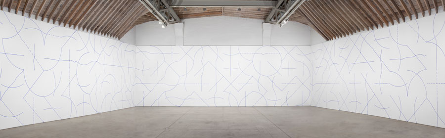]


.footnote[[A. Adler. 2017. [*Sol LeWitt: 'Arcs and Lines' At Paula Cooper Gallery, NYC.*](https://www.huffpost.com/entry/sol-lewitt-arcs-and-lines_b_870641). Huffpost.]]


???
  

https://www.youtube.com/watch?v=VnSMIgsPj5M
https://www.huffpost.com/entry/sol-lewitt-arcs-and-lines_b_870641
https://www.youtube.com/watch?v=fyxIfw_VZWA

* https://www.ecosia.org/images?q=lewitt%20Wall%20Drawing%20%23122,&addon=firefox&addonversion=4.1.0
* Solomon "Sol" LeWitt (September 9, 1928 – April 8, 2007) was an American artist linked to various movements, including conceptual art and minimalism.[1] 
* In Wall Drawing #122, first installed in 1972 at the Massachusetts Institute of Technology in Cambridge, the work contains "all combinations of two lines crossing, placed at random, using arcs from corners and sides, straight, not straight and broken lines" resulting in 150 unique pairings that unfold on the gallery walls. LeWitt further expanded on this theme, creating variations such as Wall Drawing #260 at the Museum of Modern Art, New York, which systematically runs through all possible two-part combinations of arcs and lines.[23] Conceived in 1995, Wall Drawing #792: Black rectangles and squares underscores LeWitt's early interest in the intersections between art and architecture. Spanning the two floors of the Barbara Gladstone Gallery, Brussels, this work consists of varying combinations of black rectangles, creating an irregular grid-like pattern.[24]

---
.header[Artistic Interpretation | Sol LeWitt - Wall Drawing #122, 1972]

.center[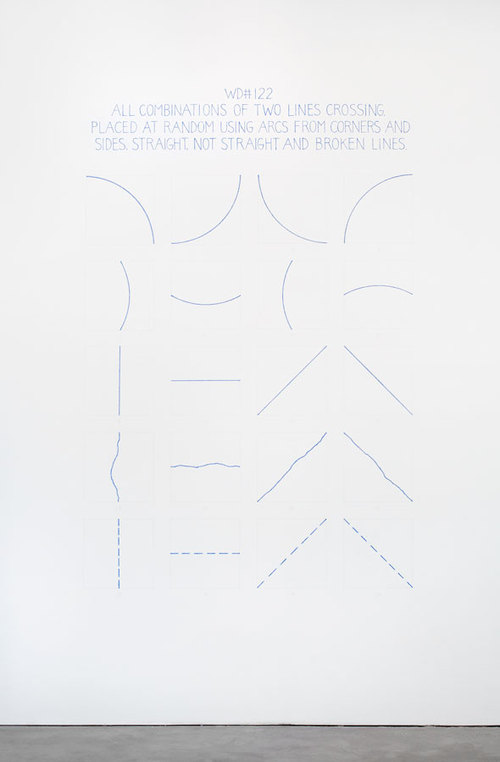]

.footnote[[A. Adler. 2017. [*Sol LeWitt: 'Arcs and Lines' At Paula Cooper Gallery, NYC.*](https://www.huffpost.com/entry/sol-lewitt-arcs-and-lines_b_870641). Huffpost.]]

---
.header[Artistic Interpretation | Sol LeWitt - Wall Drawing #122, 1972]

.center[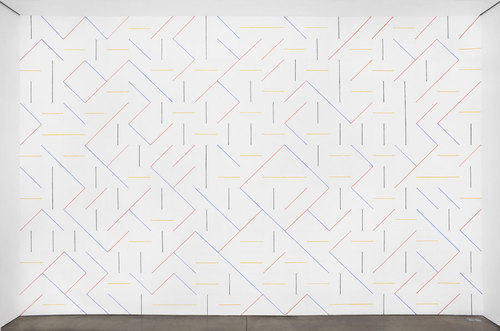]

.footnote[[A. Adler. 2017. [*Sol LeWitt: 'Arcs and Lines' At Paula Cooper Gallery, NYC.*](https://www.huffpost.com/entry/sol-lewitt-arcs-and-lines_b_870641). Huffpost.]]

---
.header[Artistic Interpretation | Sol LeWitt - Wall Drawing #122, 1972]

.center[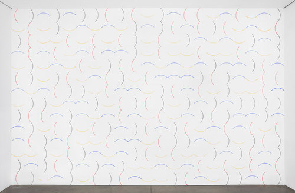]

.footnote[[A. Adler. 2017. [*Sol LeWitt: 'Arcs and Lines' At Paula Cooper Gallery, NYC.*](https://www.huffpost.com/entry/sol-lewitt-arcs-and-lines_b_870641). Huffpost.]]

---
.header[Artistic Interpretation | Sol LeWitt]

<br >
.center[<iframe width="860" height="550" src="https://www.youtube.com/embed/fyxIfw_VZWA?si=Z94BwAnC0cli_3mi" title="YouTube video player" frameborder="0" allow="accelerometer; autoplay; clipboard-write; encrypted-media; gyroscope; picture-in-picture; web-share" allowfullscreen></iframe>]

---
.header[Artistic Interpretation]

## Yoko Ono - Grapefruit, 1964

> ...an early example of conceptual art, containing a series of "event scores" that replace the physical work of art – the traditional stock-in-trade of artists – with instructions that an individual may, or may not, wish to enact. 
  
.footnote[[Wikipedia. 2023. [*Grapefruit (book)*](https://en.wikipedia.org/wiki/Grapefruit_(book)).]]
  
---
.header[Artistic Interpretation]

## Yoko Ono - Grapefruit, 1964

.left-even[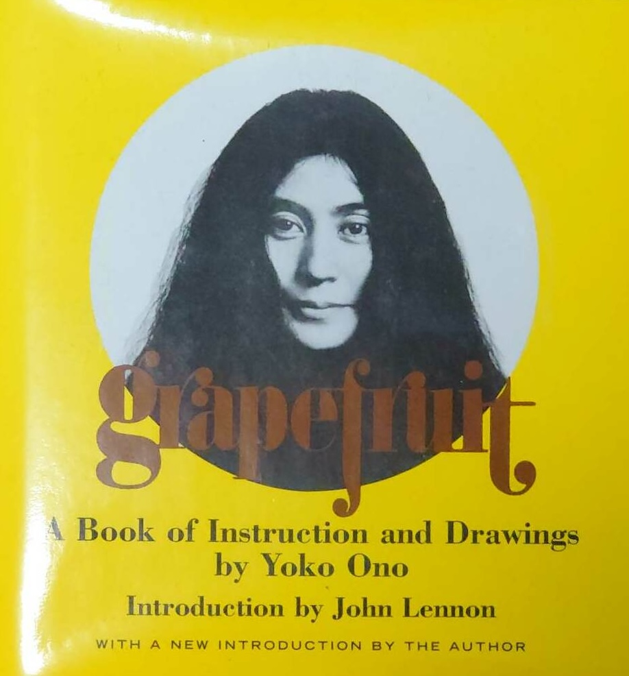]

--
.right-even[
> Grapefruit is one of the monuments of conceptual art of the early 1960s. She has a lyrical, poetic dimension that sets her apart from the other conceptual artists.
  
— David Bourdon
]
.footnote[[Wikipedia. 2023. [*Grapefruit (book)*](https://en.wikipedia.org/wiki/Grapefruit_(book)), Kozy Feeling]]
  
---
.header[Artistic Interpretation | Yoko Ono - Grapefruit, 1964]

## Painting To Be Constructed In Your Head

> Go on transforming a square canvas in your head until it becomes a circle. Pick out any shape in the process and pin up or place on the canvas an object, a smell, a sound or a colour that came to your mind in association with the shape. 
  
  
— 1962 Spring Sogetsu

  
.footnote[[Wikipedia. 2023. [*Grapefruit (book)*](https://en.wikipedia.org/wiki/Grapefruit_(book)).]]
  
---
.header[Artistic Interpretation | Yoko Ono - Grapefruit, 1964]

## Cloud Piece

>Imagine the clouds dripping.
> Dig a hole in your garden to
> put them in.

  
— 1963 Spring

  
.footnote[[Wikipedia. 2023. [*Grapefruit (book)*](https://en.wikipedia.org/wiki/Grapefruit_(book)).]]
  
---
.header[Artistic Interpretation | Yoko Ono - Grapefruit, 1964]

## Snow Piece

>Think that snow is falling. Think that snow is falling everywhere all the time. When you talk with a person, think that snow is falling between you and on the person. Stop conversing when you think the person is covered by snow. 

  
— 1963

  
.footnote[[Wikipedia. 2023. [*Grapefruit (book)*](https://en.wikipedia.org/wiki/Grapefruit_(book)).]]
  
---
.header[Artistic Interpretation | Yoko Ono - Grapefruit, 1964]

## Tuna Sandwich Piece

>Imagine one thousand suns in the sky at the same time. Let them shine for one hour. Then, let them gradually melt into the sky. Make one tunafish sandwich and eat. 

  
— 1964 Spring

.footnote[[Wikipedia. 2023. [*Grapefruit (book)*](https://en.wikipedia.org/wiki/Grapefruit_(book)).]]
  


---
template:inverse


# Functions


---
## Functions

--

Defining the function:

```
function theBestLineEver(x1, y1, x2, y2) {
    beginShape();
    vertex(x1, y1);
    vertex(x2, y2);
    endShape();
}
```

--

Calling the function:

```
theBestLineEver(10, 10, 50, 50);
```

---
## Functions

Defining the function:

```
function name([parameter]) {

    // code

    [return value]
}
```

--

> A function is a reusable block of code that performs a specific task and can be executed (called) with optional input values (parameters) to return an output (result).


---
## Functions


???

Similarly to how we used arrays last week, we can use functions to organize code.

--

Use functions for code

--
* reusability

--

* readability

--

* robustness


---
## Code Organisation with Functions

[[Create a Function →]](https://editor.p5js.org/legie/sketches/r95sZbpAr)


???

Final: https://editor.p5js.org/legie/sketches/libm3zuW8


```
function draw() {
    drawFlower(80, 90, 75);
    drawFlower(225, 80, 45);
    drawFlower(75, 225, 55);
    drawFlower(220, 220, 65);
}

function drawFlower(flowerX, flowerY, petalSize) {

    let petalDistance = petalSize / 2;

    fill(200, 0, 100);

    // upper-left petal
    circle(flowerX - petalDistance, flowerY - petalDistance, petalSize);

    // upper-right petal
    circle(flowerX + petalDistance, flowerY - petalDistance, petalSize);

    // lower-left petal
    circle(flowerX - petalDistance, flowerY + petalDistance, petalSize);

    // lower-right petal
    circle(flowerX + petalDistance, flowerY + petalDistance, petalSize);

    // center petal
    fill(255, 255, 0);
    circle(flowerX, flowerY, petalSize);
}
```

```
for(let n = 0; n < 50; n ++){
    let tmpX= random(-width, width);
    let tmpY= random(-height, height);
    let tmpSize = random(5, 50);
    drawFlower(tmpX, tmpY, tmpSize);
}
```


---
## Code Organisation with Functions

[[Create a Function →]](https://editor.p5js.org/legie/sketches/r95sZbpAr)

<br />

[[Make Code More Readable →]](https://editor.p5js.org/legie/sketches/m5Z-lTkXB)


???

* Game Final: https://editor.p5js.org/legie/sketches/lLIapghZK
* 


```

// MAIN PROGRAM
//-------------------

function preload() {

    loadBackground();
    loadPlayer();

}

function setup() {
    createCanvas(480, 360);

    initBackground();
    initPlayer();

}

function draw() {
    
    animateBackground();
    animatePlayer();

}
```

---
.header[Code Organisation with Functions]

```js
function preload() {

    loadBackground();
    loadPlayer();
}

function setup() {
    createCanvas(480, 360);

    initBackground();
    initPlayer();
}

function draw() {
    
    animateBackground();
    animatePlayer();
}
```


---
## The Jumping Game

> How to add sound?

--

Sound is not directly available as functionality in p5.

--

We have to load a library for it.

---
template: inverse

# Libraries

---

## Libraries

* p5 extends JavaScript

???
  

* The same way p5 is written to extend the base functionality of JavaScript, we can write code that further extends p5.  

--
* Additional libraries extend p5, e.g., for sound

???

* A library is code in regard to a certain topic, e.g. sound, that is somewhat generalized and of use in various contexts.
* Libraries should be compact and also as small as possible. That is one of the reasons why additional libraries are not simply added to p5 itself. 
 
--
* Written by different people


???
  

* Libraries are mostly written by other people or teams and it is easier to manage to keep the development of an additional library separated.


---

## Library Examples

### 

Use the [ml5](https://ml5js.org/) for machine learning in an accessible and easy way.
  
.center[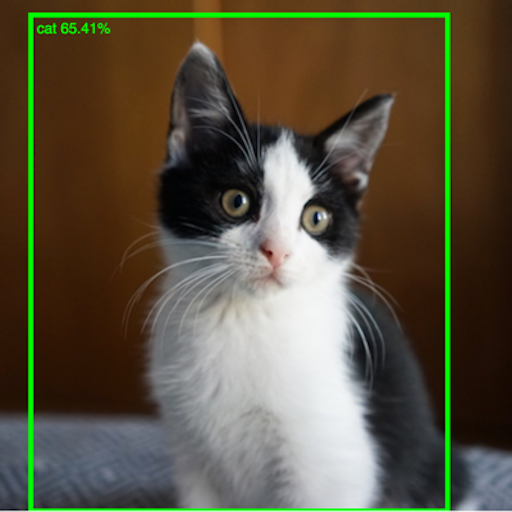 .imgref[[[ml5]](https://ml5js.org/)]]

---

## Library Examples

A library to create a [scribble effect](https://github.com/generative-light/p5.scribble.js):  
  
<br />

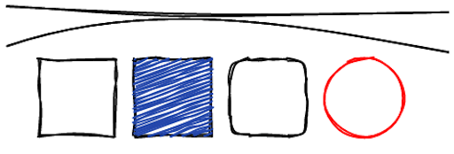 .imgref[[[p5.scribble]](https://github.com/generative-light/p5.scribble.js)]


???
  

* https://editor.p5js.org/legie/sketches/PtoiQsgKr


---

## Library Examples

A library to create a [a touch gui](https://github.com/L05/p5.touchgui):

.center[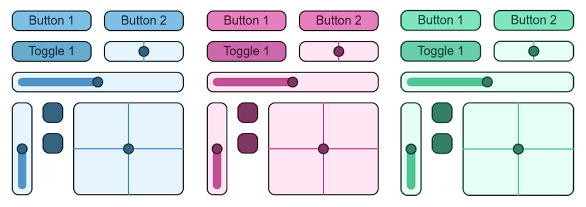]  [[p5.touchgui]](https://github.com/L05/p5.touchgui)


???

* https://editor.p5js.org/L05/sketches/LWfA8lGwe


---

## Libraries

You can find a list of the currently supported p5 libraries [on the p5 website](https://p5js.org/libraries/).

--

> Depending on your tasks, using a library can make your life much easier.

--

Keep in mind 

* The quality of the code and its documentation might vary

--
* If a library is listed on the official p5 website, it is probably ok

---

## Libraries

For loading libraries we have to take a look behind the scenes...

---
template: inverse

# The Anatomy of a Webpage

---
.header[The Anatomy of a Webpage]

## Behind The Scenes

.center[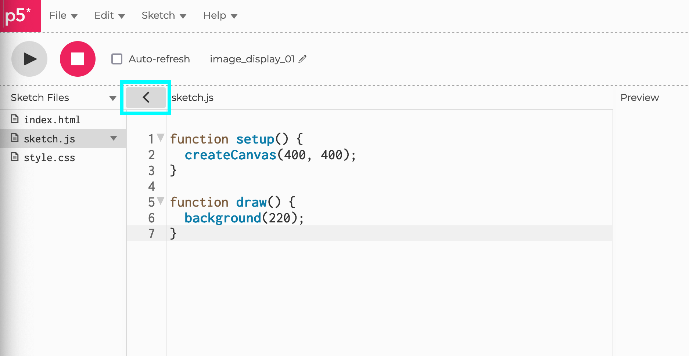]

---

## The Anatomy of a Webpage

* `index.html`
* `style.css`
* `sketch.js`

---

## The Anatomy of a Webpage

* `index.html` (***displaying***)
* `style.css` 
* `sketch.js`

---

## The Anatomy of a Webpage

* `index.html` (***displaying***)
* `style.css` (***styling***)
* `sketch.js` 

---

## The Anatomy of a Webpage

* `index.html` (***displaying***)
* `style.css` (***styling***)
* `sketch.js` (***interacting***)

---
.header[Anatomy of a Webpage]

## Html

Tags for formatting content that displays a webpage:

```html
<!DOCTYPE html>
<html>
	<head>
		<title>A Very Important Webpage</title>
	</head>
	<body>
		<h1>Hello World</h1>
		<p>This is a paragraph.</p>
	</body>
</html>
```

---
.header[Anatomy of a Webpage]

## Html

```html
<!DOCTYPE html>
<html lang="en">
  <head>
    <script src="https://cdnjs.cloudflare.com/ajax/libs/p5.js/1.6.0/p5.js"></script>
    <script src="https://cdnjs.cloudflare.com/ajax/libs/p5.js/1.6.0/addons/p5.sound.min.js"></script>
    <link rel="stylesheet" type="text/css" href="style.css">
    <meta charset="utf-8" />
  </head>
  <body>
    <main></main>
    <script src="sketch.js"></script>
  </body>
</html>
```

--

In the html file, we must link any other relevant files, such as `.css` or `.js`.


???
  

* Add the hello world code


---
.header[Anatomy of a Webpage]

## CSS

Styles html elements, identified by selectors (e.g., their tag name).

--

Linking in the `.html`:

```html
<link rel="stylesheet" type="text/css" href="style.css">
```

--

The `.css` file:

```css
body {
  background: yellow;
}
```

???
  

* Add css code

---
.header[Anatomy of a Webpage]

## JavaScript

Enables a webpage to be interactive. This is, e.g., our p5 `sketch.js` file. 

--

Linking in the `.html`:

```html
<script src="sketch.js"></script>
```

--

The `sketch.js` file:

```js
function setup() {
  createCanvas(400, 400);
}
function draw() {
  background(220);
}
```


???
  

* https://editor.p5js.org/KevinWorkman/sketches/PnmzefAsr


---
.header[Anatomy of a Webpage]

## Libraries

Two options:


--
* Accessed by a given online link

```c#
<script src="https://cdnjs.cloudflare.com/ajax/libs/p5.js/1.6.0/p5.js"></script>
```


--
* Add file to project
  
```c#
<script src="p5.scribble.js"></script>
```

---

```html
<!DOCTYPE html>
<html lang="en">
  <head>
    <script src="https://cdnjs.cloudflare.com/ajax/libs/p5.js/1.6.0/p5.js"></script>
    <script src="https://cdnjs.cloudflare.com/ajax/libs/p5.js/1.6.0/addons/p5.sound.min.js"></script>

    <script src="p5.scribble.js"></script>

    <link rel="stylesheet" type="text/css" href="style.css">
    <meta charset="utf-8" />

  </head>
  <body>
    <main>
    </main>
    <script src="sketch.js"></script>
  </body>
</html>
```

???
  

* https://idmnyu.github.io/p5.js-speech/
* Since recently, the sound library is already linked by default.

---
template:inverse

# The Sound Library


---

## Sound

Since recently, the [sound library](https://p5js.org/reference/p5.sound/) is already linked by default.

```html
<script src="https://cdnjs.cloudflare.com/ajax/libs/p5.js/1.6.0/addons/p5.sound.min.js"></script>
```

--

This library is actually developed by the p5 team and is therefore also [documented on the p5 website](https://p5js.org/reference/p5.sound/).  


???

There is a lot of functionality provided to work with sound and [many examples given](https://p5js.org/examples/).

---

## Sound

Working with sound files follows pretty much the same logic as working with images:

--
* Add the sound files as asset to your sketch environment

--
* Load the sound file and...

--
* ...save it in a variable

--
* Work with that variable

--
  
```js
let jinggle;

function preload() {
    jinggle = loadSound('blues_string.mp3'); // A sound file object
}
```

---

.header[Sound]

## Loading And Playing A Sound File

The most basic functions for working with a [sound variable](https://p5js.org/reference/#/p5.SoundFile) are:

* start()
* stop()
* pause()
  
--

These functions belong to the sound object, hence you have to attach them with a dot:

```js
let jinggle = loadSound(...);

jinggle.start();
jinggle.stop();
```

---
.header[Sound | Loading And Playing A Sound File]

```js
// https://editor.p5js.org/legie/sketches/GDm7gNbaa

let jinggle;

function preload() {
    jinggle = loadSound('blues_string.mp3'); // A sound file object
}

function setup() {...}

function mousePressed() {
    // .isPlaying() returns a boolean  
    if (jinggle.isPlaying()) {
        jinggle.stop();
        background(255, 0, 0);
    } else {
        jinggle.play();
        background(0, 255, 0);
    }
}
```


---

.header[Sound]


## PlayMode

A p5.SoundFile has two play modes 

--

* `restart`
* `sustain`

The play mode determines what happens to a p5.SoundFile if it is triggered while in the middle of playback.  


---

.header[Sound]


## PlayMode

A p5.SoundFile has two play modes 

* `restart`: stop and start over
* `sustain`: add a new playback

The play mode determines what happens to a p5.SoundFile if it is triggered while in the middle of playback.  


---

.header[Sound | PlayMode]


```js
// https://editor.p5js.org/legie/sketches/MhBMTNwFs

let jinggle;

function preload() {
	jinggle = loadSound('blues_string.mp3');
}

function setup() {
	createCanvas(windowWidth, windowHeight);
	
	//jinggle.playMode('restart');
	jinggle.playMode('sustain');
}

function mousePressed() {
	
	background(random(255));
	jinggle.play();
}
```

---

## Sound


There are many, many more given functions to work with sound. For example, you can also record sound with p5.


---
.header[The Jumping Game]

## Adding Background Music


You can also add a song to the world, which continuously plays in loop.  


???

I add this to the background tab, as to me it feels like "background music" but you could also structure your game differently, e.g. adding the sound to mySketch. 

--

<br />

For looping a sound, you can simply call `soundBackground.loop();`. We can also reduce the file's volume a bit with [`setVolume()`](https://p5js.org/reference/#/p5.SoundFile/setVolume).

---
.header[The Jumping Game | Adding Background Music]

```js
// Jumping Game - Sound Loop
// https://editor.p5js.org/legie/sketches/_Fn4xTETJ

let bgSound;

function loadBackground() {
    ...
    // Loading the soundfile
    bgSound = loadSound('theme_loop.wav');
}

function initBackground() {
    ...
    // Repeating the sound file
    bgSound.loop();
    
    // Reducing the volume with 
    // a value between 0 (no sound) to 1 (full volume)
    bgSound.setVolume(0.1);
}
...
```

---
template: inverse

# Coins

---
.header[The Jumping Game]

## Coins

???
  
* Show result: https://editor.p5js.org/legie/sketches/_Fn4xTETJ


--
* Place coins

--
* Animate coins

--
* Make coins collectable upon collision


???
  
* Develop interactively
* Start


---
.header[The Jumping Game | Coins]

## Place Coins

```js
function loadCoin() {
    for (i = 0; i < coinNumberImg; i++) {
        coinImg[i] = loadImage("coin-" + i + ".png");
    }
}

```


---
.header[The Jumping Game | Coins]

## Place Coins

```js
function initCoin() {
    // Place the coin at the right side of the screen...
    coinX = bgImg.width;

    // ...at a random height between
    // 100 (because we don't want the coin too high)
    // and
    // the sketch height minus the coin image size
    // minus the ground height visible at the background image
    coinY = random(100, height - coinSize - bgGroundHeight);
}
```
---
.header[The Jumping Game | Coins]

## Place Coins

```js
function animateCoin() {
  image(coinImg[coinImgIndex], coinX, coinY);

  // Display the image animation
  if (frameCount % coinAnimationSlowDown == 0) {
    
    // Every coinAnimationSlowDown-th frame
    coinImgIndex++; // Next image

    if (coinImgIndex == coinNumberImg) {
      // Reached last image
      coinImgIndex = 0; // Back to first image
    }
  }
}
```

---
.header[The Jumping Game | Coins]

## Animate Coins

```
    // Move the coin to the left (with the background)
    coinX -= bgSpeed;
```

---
.header[The Jumping Game | Coins]

## Make Coins Collectable

--

Coins should disappear ("being collected") when the player collides with it. 


???
  

* We will add counting points later.

--
* New variable `let coinCollected = false;`

--

```js
function initCoin() {

    ...
    coinCollected = false;
}
```

???
  

* For tracking whether a coin is collected or not, add in the coin tab a global variable for that, e.g. `coinCollected` and set it to `false`.
* Think about it for a moment how you could detect a collision between the player and the coin. Feel free to use your own solution for that. One possibility is to set a collision to `true`, 

---
.header[The Jumping Game | Coins]

## Player-Coin Collision

Measure distance between player and coin:

--

```js
dist(coinX, coinY, playerX, playerY) <= playerSize/2 + coinSize/2
```


???
  

* if the distance between the player and the coin positions is equal or less than both of their "radii" (half their size). 
* https://p5js.org/reference/#/p5/dist

--
If the distance becomes too small, set `coinCollected = true;`:

```js
    if (dist(coinX, coinY, playerX, playerY) <= playerSize/2 + coinSize/2) {
        coinCollected = true;
    }
```


---
.header[The Jumping Game | Coins]

## Player-Coin Collision

```js
function animateCoin() {
    ...

    // Check for collision between coin and player:
    if (dist(coinX, coinY, playerX, playerY) <= playerSize * 0.5 + coinSize  * 0.5) {
        coinCollected = true;
    }

}


```


---
.header[The Jumping Game | Coins]

## Make Coins Collectable

What should happen if `coinCollected` is true?

--
* Delete the old coin, start a new one

???
  

* For that we can simply call the `initCoin` function. And we already have the code for that in the `animateCoin` function for the case of the coin moving outside of the screen on the left. To this check we can add a condition which checks for `coinCollected` to be true and modify the "out of screen check" from step 4 to the following:

---
.header[The Jumping Game]

## Coin - Player Collision

```js
    // Give the coin a new position when it left the screen or got collected
    if (coinCollected) {
        initCoin();
    }
```


???
  

Make sure that the above code comes after the `if (dist(...)){}` check. Also, very important: we also need to set `coinCollected` back to false (otherwise no new coins will re-appear). Add that to the `initCoin()` function.

--

* We should also init a new coin, if the old one runs out of the canvas

--

```js
    // Give the coin a new position when it left the screen or got collected
    if (coinX <= 0 - coinImg[1].width || coinCollected) {
        initCoin();
    }
```


---
.header[The Jumping Game]

## Sound Effect For Coins

Adding a sound effect to a game whenever a player collected a point could look as follows.  

???

For that we need to load the sound file and play it upon player-coin collision. As the sound somewhat "belongs" to a coin, we add the code to the coin tab. 
  
Start: https://editor.p5js.org/legie/sketches/Zj1vmVWWT

---
```js
// https://editor.p5js.org/legie/sketches/_Fn4xTETJ

// Sound Variable
let soundCollected;
function loadCoin() {
    ...
    // Loading the sound file, saving it in soundCollected
    soundCollected = loadSound('coin_collected.wav');
    soundCollected.playMode('restart');
}

function animateCoin() {
    ...
    // Check for collision between coin and player:
    if (dist(coinX, coinY, playerX, playerY) <= playerSize / 2 + coinSize / 2) {
        coinCollected = true;

        // Playing the sound effect
        soundCollected.play();
    }
    ...
}
```


???
  

* https://editor.p5js.org/legie/sketches/_Fn4xTETJ


---
.header[The Jumping Game]

## File Structure

--

As we can load libraries, we can split our `sketch.js` and load those files.

--

* `sketch.js`
* `background.js`
* `player.js`
* `coin.js`

--

`Sketch Files` -> `Create File`

--

```html
    <script src="background.js"></script>
    <script src="player.js"></script>
    <script src="coin.js"></script>
```

--

This is exactly the same as having all code in one file.


???
  

* https://editor.p5js.org/legie/sketches/2nuJGEvFr


---
template:inverse

# Summary

---

## Summary

--

Libraries

--
* Libraries extend p5 in regard to one specific topic

--
* You have to load and link a library for a sketch

--
* For knowing how to use a library you have to refer to the library's given documentation, it is not necessarily on the p5 page
  
---

## Summary

[p5.sound](https://p5js.org/reference/#/libraries/p5.sound)

--

```js 
let song;

function preload() {
    song = loadSound('song.mp3');
}
```

--

```js
song.playMode('restart');
song.setVolume(0.1);
song.play();

...

song.stop();
```

---

## Summary

Use the [reference](https://p5js.org/reference/) 🚒


---
template:inverse

## The End

# 📚 🎹 🎧

